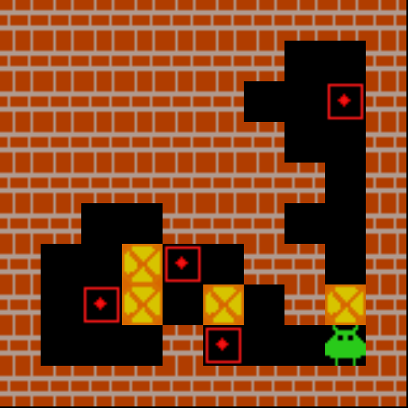
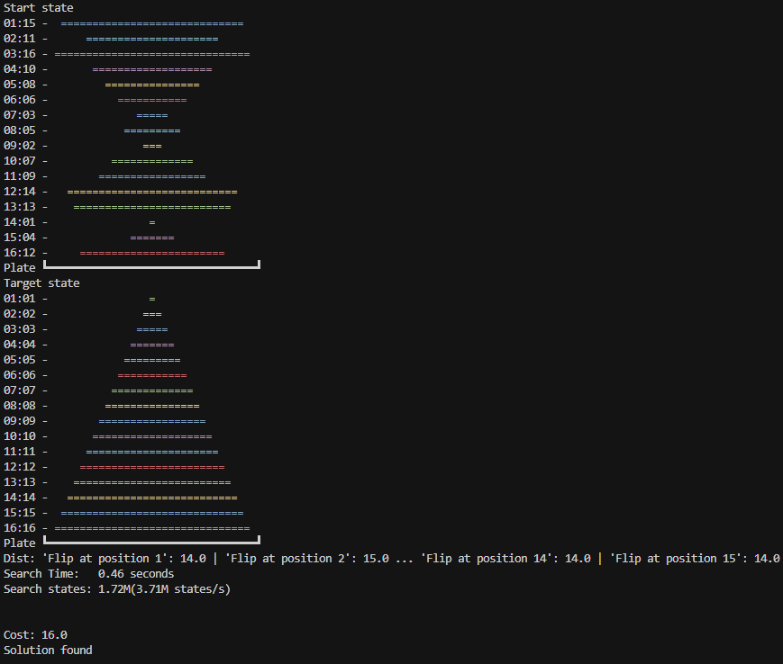
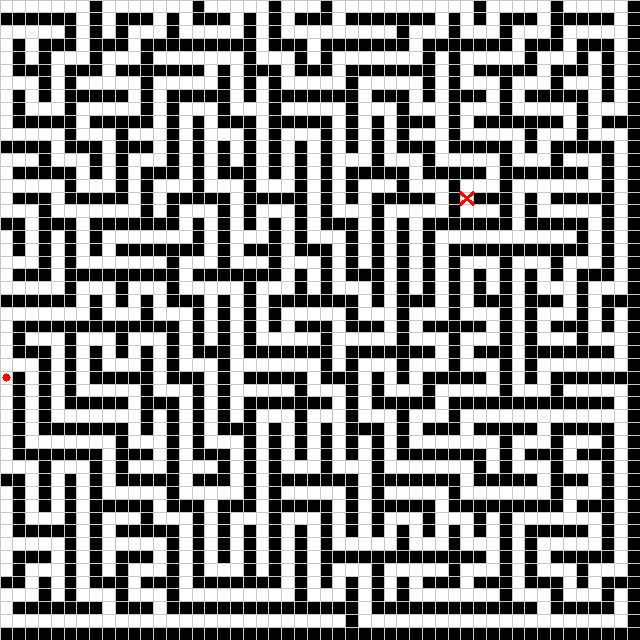
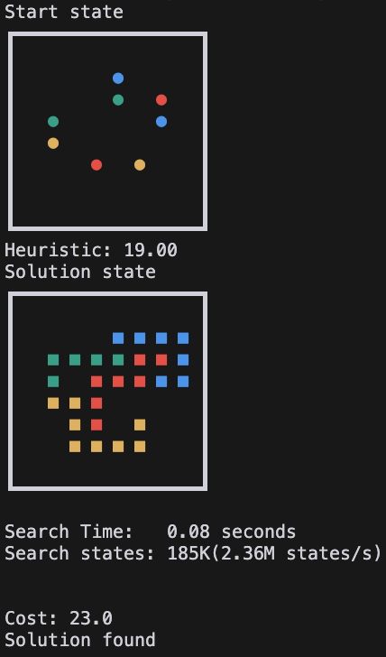
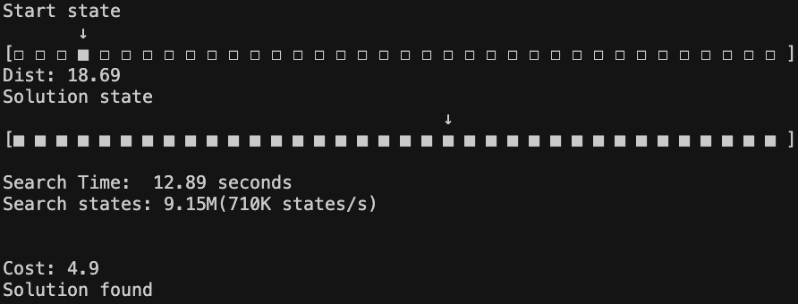
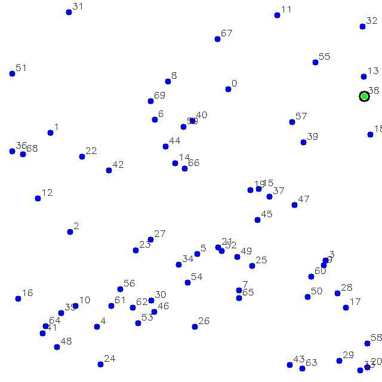
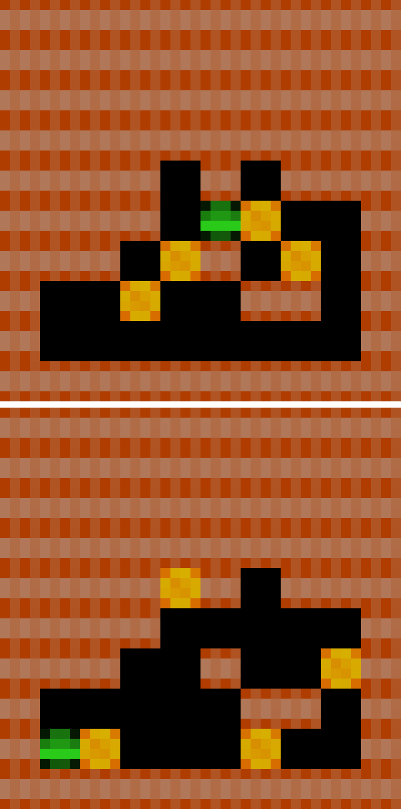

<div align="center">
  </img>
</div>

# JA<sup>xtar</sup>: GPU-accelerated Batched parallel A\* & Q\* solver in pure JAX!

JA<sup>xtar</sup> is a project with a JAX-native implementation of parallelizable a A\* & Q\* solver for neural heuristic search research.
This project is inspired by [mctx](https://github.com/google-deepmind/mctx) from Google DeepMind. If MCTS can be implemented entirely in pure JAX, why not A\*?

MCTS, or tree search, is used in many RL algorithmic techniques, starting with AlphaGo, but graph search (not tree search) doesn't seem to have received much attention. Nevertheless, there are puzzle‐solving algorithms that use neural heuristics like [DeepcubeA](https://github.com/forestagostinelli/DeepCubeA) with A\* or [Q\*](https://arxiv.org/abs/2102.04518)(graph search).

However, the most frustrating aspect of [my brief research (MSc)](https://drive.google.com/file/d/1clo8OmuXvIHhJzOUhH__0ZWzAamgVK84/view?usp=drive_link) in this area is the time it takes to pass information back and forth between the GPU and CPU.
When using a neural heuristic to evaluate a single node, the communication between the CPU and GPU, rather than the computation itself, can consume between 50% and 80% of the total processing time. Because of this communication overhead, DeepcubeA batches multiple nodes concurrently, which appears to work quite well.

However, these issues indicate that a more fundamental solution is needed. This led me to search for ways to perform A\* directly on the GPU, but I discovered that most implementations suffer from the following problems.

- Many are written in pure C and CUDA, which is not well-suited for machine learning research.
- Some are written in JAX or PyTorch, but these are often limited to 2D grid environments or connectivity matrices, and cannot scale to an infinite number of different states that cannot all be held in memory.
- The implementation itself is often dependent on the specific definition of the state or problem.

To address these challenges, I decided to develop code based on the following principles:

- Pure JAX implementation
  - Specifically for machine learning research.
- JAX-native priority queue
  - The A\* algorithm necessitates a priority queue to process nodes based on the lowest combined cost and heuristic estimate.
  - However, standard Python heaps use lists, which are not JIT-compilable in JAX. Thus, a JAX-iterable heap is necessary.
- Hashable state representation and a hashtable for JAX operations.
  - This is crucial for tracking node status (open/closed) in A\* and efficiently retrieving parent state information.
  - Hashing is optional for simple, indexable states. But for complex or infinite state spaces, hashing becomes essential for efficient indexing and retrieval of unique states.
- Fully batched and parallelized operations
  - GPUs provide massive parallelism but have slower cores than CPUs. Therefore, algorithms for GPUs must be highly parallelized to leverage their architecture.
- Puzzle-agnostic implementation
  - The implementation should be general enough to handle any puzzle with a defined state and action space.
  - This generality enables wider research and allows for formalizing 'strict' behaviors in future implementations.

This project features specially written components, including:

- a hash function builder to convert defined states into hash keys
- a hashtable for parallel lookup and insertion operations
- a priority queue that supports batching, push, and pop operations
- Implementations for puzzles such as Rubik's Cube, Slide Puzzle, Lights Out, and Sokoban
- Network heuristics and Q-functions designed for JIT-compilable integration with A\* & Q\* algorithm
- a fully JIT-compiled A\* & Q\* algorithm for puzzles

This project was quite challenging to develop, and it felt like performing acrobatics with JAX. However, I managed to create a fully functional version, and hopefully it will inspire you to discover something amazing as you delve into JAX.

## Result

We can find the optimal path using a jittable, batched A\* search as shown below. This is not a super blazingly fast result, but it can be well integrated with heuristics using neural networks.

The following speed benchmarks were measured on an Nvidia RTX 5090 hosted at vast.ai.

You can easily test it yourself with the colab link below.

[](https://colab.research.google.com/drive/1TJUazlkm9miP4sIKCXShExaRcT6oGD4K?usp=sharing)

### Test Run

```bash
$ python main.py astar
Start state
┏━━━┳━━━┳━━━┳━━━┓
┃ 5 ┃ E ┃ 2 ┃ 3 ┃
┣━━━╋━━━╋━━━╋━━━┫
┃ D ┃ B ┃ 9 ┃ 7 ┃
┣━━━╋━━━╋━━━╋━━━┫
┃ A ┃ F ┃ 4 ┃ C ┃
┣━━━╋━━━╋━━━╋━━━┫
┃   ┃ 8 ┃ 6 ┃ 1 ┃
┗━━━┻━━━┻━━━┻━━━┛
Target state
┏━━━┳━━━┳━━━┳━━━┓
┃ 1 ┃ 2 ┃ 3 ┃ 4 ┃
┣━━━╋━━━╋━━━╋━━━┫
┃ 5 ┃ 6 ┃ 7 ┃ 8 ┃
┣━━━╋━━━╋━━━╋━━━┫
┃ 9 ┃ A ┃ B ┃ C ┃
┣━━━╋━━━╋━━━╋━━━┫
┃ D ┃ E ┃ F ┃   ┃
┗━━━┻━━━┻━━━┻━━━┛
Dist: 33.00
Search Time:   0.24 seconds
Search states: 1.04M(4.25M states/s)

Cost: 49.0
Solution found
```

### Test vmapped run

```bash
$ python main.py astar --vmap_size 20
Vmapped A* search, multiple initial state solution
Start states
┏━━━┳━━━┳━━━┳━━━┓  ┏━━━┳━━━┳━━━┳━━━┓  ...              ┏━━━┳━━━┳━━━┳━━━┓  ┏━━━┳━━━┳━━━┳━━━┓
┃ 5 ┃ E ┃ 2 ┃ 3 ┃  ┃ 5 ┃ E ┃ 2 ┃ 3 ┃  (batch : (20,))  ┃ 5 ┃ E ┃ 2 ┃ 3 ┃  ┃ 5 ┃ E ┃ 2 ┃ 3 ┃
┣━━━╋━━━╋━━━╋━━━┫  ┣━━━╋━━━╋━━━╋━━━┫                   ┣━━━╋━━━╋━━━╋━━━┫  ┣━━━╋━━━╋━━━╋━━━┫
┃ D ┃ B ┃ 9 ┃ 7 ┃  ┃ D ┃ B ┃ 9 ┃ 7 ┃                   ┃ D ┃ B ┃ 9 ┃ 7 ┃  ┃ D ┃ B ┃ 9 ┃ 7 ┃
┣━━━╋━━━╋━━━╋━━━┫  ┣━━━╋━━━╋━━━╋━━━┫                   ┣━━━╋━━━╋━━━╋━━━┫  ┣━━━╋━━━╋━━━╋━━━┫
┃ A ┃ F ┃ 4 ┃ C ┃  ┃ A ┃ F ┃ 4 ┃ C ┃                   ┃ A ┃ F ┃ 4 ┃ C ┃  ┃ A ┃ F ┃ 4 ┃ C ┃
┣━━━╋━━━╋━━━╋━━━┫  ┣━━━╋━━━╋━━━╋━━━┫                   ┣━━━╋━━━╋━━━╋━━━┫  ┣━━━╋━━━╋━━━╋━━━┫
┃   ┃ 8 ┃ 6 ┃ 1 ┃  ┃   ┃ 8 ┃ 6 ┃ 1 ┃                   ┃   ┃ 8 ┃ 6 ┃ 1 ┃  ┃   ┃ 8 ┃ 6 ┃ 1 ┃
┗━━━┻━━━┻━━━┻━━━┛  ┗━━━┻━━━┻━━━┻━━━┛                   ┗━━━┻━━━┻━━━┻━━━┛  ┗━━━┻━━━┻━━━┻━━━┛
Target state
┏━━━┳━━━┳━━━┳━━━┓  ┏━━━┳━━━┳━━━┳━━━┓  ...              ┏━━━┳━━━┳━━━┳━━━┓  ┏━━━┳━━━┳━━━┳━━━┓
┃ 1 ┃ 2 ┃ 3 ┃ 4 ┃  ┃ 1 ┃ 2 ┃ 3 ┃ 4 ┃  (batch : (20,))  ┃ 1 ┃ 2 ┃ 3 ┃ 4 ┃  ┃ 1 ┃ 2 ┃ 3 ┃ 4 ┃
┣━━━╋━━━╋━━━╋━━━┫  ┣━━━╋━━━╋━━━╋━━━┫                   ┣━━━╋━━━╋━━━╋━━━┫  ┣━━━╋━━━╋━━━╋━━━┫
┃ 5 ┃ 6 ┃ 7 ┃ 8 ┃  ┃ 5 ┃ 6 ┃ 7 ┃ 8 ┃                   ┃ 5 ┃ 6 ┃ 7 ┃ 8 ┃  ┃ 5 ┃ 6 ┃ 7 ┃ 8 ┃
┣━━━╋━━━╋━━━╋━━━┫  ┣━━━╋━━━╋━━━╋━━━┫                   ┣━━━╋━━━╋━━━╋━━━┫  ┣━━━╋━━━╋━━━╋━━━┫
┃ 9 ┃ A ┃ B ┃ C ┃  ┃ 9 ┃ A ┃ B ┃ C ┃                   ┃ 9 ┃ A ┃ B ┃ C ┃  ┃ 9 ┃ A ┃ B ┃ C ┃
┣━━━╋━━━╋━━━╋━━━┫  ┣━━━╋━━━╋━━━╋━━━┫                   ┣━━━╋━━━╋━━━╋━━━┫  ┣━━━╋━━━╋━━━╋━━━┫
┃ D ┃ E ┃ F ┃   ┃  ┃ D ┃ E ┃ F ┃   ┃                   ┃ D ┃ E ┃ F ┃   ┃  ┃ D ┃ E ┃ F ┃   ┃
┗━━━┻━━━┻━━━┻━━━┛  ┗━━━┻━━━┻━━━┻━━━┛                   ┗━━━┻━━━┻━━━┻━━━┛  ┗━━━┻━━━┻━━━┻━━━┛
vmap astar
# search_result, solved, solved_idx =jax.vmap(astar_fn, in_axes=(None, 0, 0, None))(inital_search_result, states, filled, target)
Search Time:   5.28 seconds (x21.6/20)
Search states: 20.7M (3.93M states/s) (x0.9 faster)
Solution found: 100.00%
# this means astart_fn is completely vmapable and jitable
```

### A\* with neural heuristic model

```bash
$ python main.py astar -nn -h -p rubikscube -w 0.2

...

Dist: 14.62

Search Time:   0.79 seconds
Search states: 1.51M(1.91M states/s)


Cost: 22.0
Solution found
```

### Q\* with neural Q model

```bash
$ python main.py qstar -nn -h -p rubikscube -w 0.2

...

Dist: 'l_cw': 18.3 | 'l_ccw': 18.1 ... 'u_cw': 18.2 | 'u_ccw': 17.1
Search Time:   0.21 seconds
Search states: 1.3M(6.07M states/s)


Cost: 20.0
Solution found
```

## Puzzles

### Target available puzzle

| Rubikscube                                              | Slidepuzzle                                               | Lightsout                                             | Sokoban                                          |
| ------------------------------------------------------- | --------------------------------------------------------- | ----------------------------------------------------- | ------------------------------------------------ |
|         |         |         |         |
|  |  |  |  |


| Maze                                       | Pancake Sorting                                          | Hanoi                                        |
| ------------------------------------------ | -------------------------------------------------------- | -------------------------------------------- |
|         |         |         |
|  |  |  |

### Target not available puzzle

These types of puzzles are not strictly the kind that are typically solved with A\*, but after some simple testing, it turns out that, depending on how the problem is defined, they can be solved. Furthermore, this approach can be extended to TSP and countless other COP problems, provided that with a good heuristic. The training method will need to be investigated further.

| Dotknot                                          | TSP                                      |
| ------------------------------------------------ | ---------------------------------------- |
|         |         |
|  |  |

### World Model Puzzle

This is an implementation of learning a world model, as introduced in the paper ["Learning Discrete World Models for Heuristic Search"](https://rlj.cs.umass.edu/2024/papers/RLJ_RLC_2024_225.pdf), and performing A\* & Q\* search within that world model.

<!-- Currently, this implementation achieves node search speeds that are basically more than 10 times faster than those presented in the paper. -->

| Terminal View                                | Rubiks Cube                                               | Sokoban                                             |
| -------------------------------------------- | --------------------------------------------------------- | --------------------------------------------------- |
|  |  |  |

## Citation

Please use this citation to reference this project.

```bibtex
@software{kyuseokjung2024jaxtar,
  title = {JA^{xtar}: GPU-accelerated Batched parallel A* & Q* solver in pure JAX!},
  author = {Kyuseok Jung},
  url = {https://github.com/tinker495/JAxtar},
  year = {2024},
}
```
