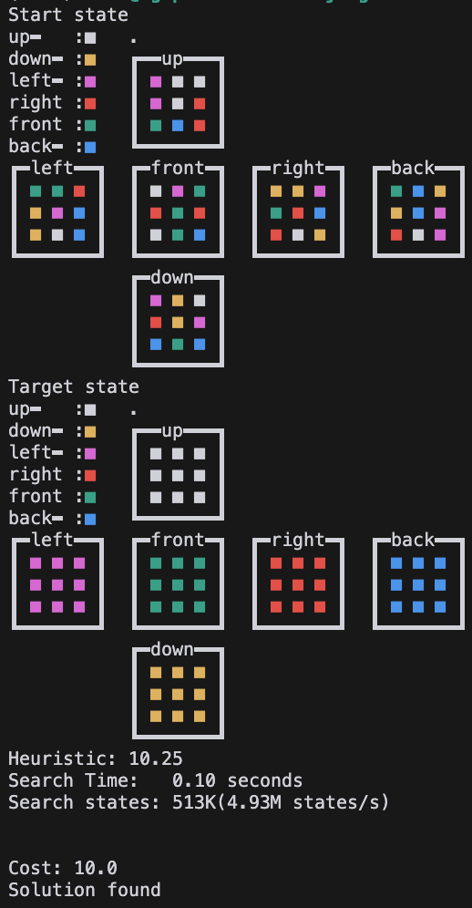
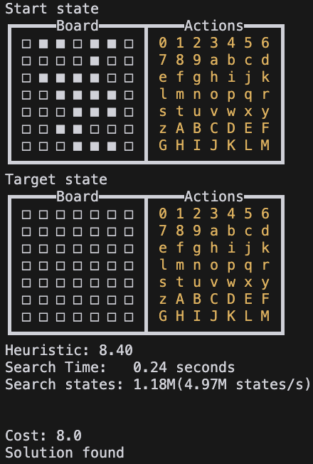

<div align="center">
  </img>
</div>

# JA<sup>xtar</sup>: Batched parallel A\* & Q\* solver in pure Jax!

JA<sup>xtar</sup> is a project with a JAX-native implementation of parallelizeable A\* solver for neural heuristic search research.
This project is inspired by [mctx](https://github.com/google-deepmind/mctx) from google-deepmind. If mcts can be written in pure jax, so why not A\*?

mcts, or tree search, is used in many RL algorithmic techniques, starting with AlphaGo, but graph search (not tree search) doesn't seem to have received much attention. Nevertheless, there are puzzle solving algorithms that use neural heuristics like [DeepcubeA](https://github.com/forestagostinelli/DeepCubeA) with A\* (graph search).

However, the most frustrating aspect of my brief research(MSc) in this area is the time it takes to pass information back and forth between the GPU and CPU.
When using neural heuristic as a heuristic to eval a single node, it uses almost 50-80% of the time. Because of this, DeepcubeA batches multiple nodes at the same time, which seems to work quite well.

However, this is not a fundamental solution, and I needed to find a way to remove this bottleneck altogether. This led me to look for ways to perform A\* on the GPU, and I found quite a few implementations, but most of them suffer from the following problems.

- They are written in pure c and cuda, which is not compatible with ML research
- They are written in jax or torch, but which are 2d grid environments or connectivity matrices, which cannot scale to an infinite number of different states that cannot all be held in memory
- The implementation itself is dependent on the definition of the state or problem.

To solve this problem, I decided to write code that adheres to the following principles and works.

- Only write in pure Jax
  - For ML research.
- Pure jax priority queue
  - A\* needs to have a priority queue because it expends nodes in the order of the node with the smallest sum of heuristic and cost
  - However, the heap used inside python uses list variables, which cannot be jitted, so we need to use a heap that can be iterated over in jax
- A hashable with a state and a hashtable that operates on it.
  - We need this to be able to know if a node in the A\* algorithm is closed, open, and what state its parent is in
  - If the state is a simple matter of parsing and indexing, we don't need to hash it, but if it's not and there are nearly infinite states, we need to hash each state to index it and access its unique value
- Everything is batched and parallelised
  - GPUs have a lot of cores, but they are very slow compared to CPUs. To overcome this, algorithms running on GPUs should be written as parallel as possible.

Specially written components in this project include:

- a hash_func_builder for convert defined states to hash keys
- a hashtable to lookup and insert in a parallel way
- a priority queue that can be batched, pushed and popped
- a fully jitted A\* algorithm for puzzles.

This project was a real pain in the arse to write, and I almost felt like I was doing acrobatics with Jax, but I managed to create a fully functional version, and hopefully it will inspire you to stumble upon something amazing when you travel to Jax.

## Result

We can find the optimal path using a jittable, batched A\* search as shown below. This is not a blazingly fast result, but it can be used for heuristics using neural networks.
The tests below were performed on a single A100 80GB GPU.

### Test Run

```bash
$ python main.py astar
Start state
┏━━━┳━━━┳━━━┳━━━┓
┃ 2 ┃ F ┃ 3 ┃ 4 ┃
┣━━━╋━━━╋━━━╋━━━┫
┃   ┃ 5 ┃ 7 ┃ B ┃
┣━━━╋━━━╋━━━╋━━━┫
┃ C ┃ 9 ┃ 1 ┃ A ┃
┣━━━╋━━━╋━━━╋━━━┫
┃ 8 ┃ E ┃ D ┃ 6 ┃
┗━━━┻━━━┻━━━┻━━━┛
Target state
┏━━━┳━━━┳━━━┳━━━┓
┃ 1 ┃ 2 ┃ 3 ┃ 4 ┃
┣━━━╋━━━╋━━━╋━━━┫
┃ 5 ┃ 6 ┃ 7 ┃ 8 ┃
┣━━━╋━━━╋━━━╋━━━┫
┃ 9 ┃ A ┃ B ┃ C ┃
┣━━━╋━━━╋━━━╋━━━┫
┃ D ┃ E ┃ F ┃   ┃
┗━━━┻━━━┻━━━┻━━━┛
Heuristic: 33.00

JIT compiled
Time:   0.62 seconds
Search states: 810K (1.31M states/s)
```

### Test vmapped run

```bash
$ python main.py astar --max_node_size 1e6 --batch_size 1024 --vmap_size 10
Vmapped A* search, multiple initial state solution
Start state
┏━━━┳━━━┳━━━┳━━━┓
┃ 2 ┃ F ┃ 3 ┃ 4 ┃
┣━━━╋━━━╋━━━╋━━━┫
┃   ┃ 5 ┃ 7 ┃ B ┃
┣━━━╋━━━╋━━━╋━━━┫
┃ C ┃ 9 ┃ 1 ┃ A ┃
┣━━━╋━━━╋━━━╋━━━┫
┃ 8 ┃ E ┃ D ┃ 6 ┃
┗━━━┻━━━┻━━━┻━━━┛
.
.
. x 10
Target state
┏━━━┳━━━┳━━━┳━━━┓
┃ 1 ┃ 2 ┃ 3 ┃ 4 ┃
┣━━━╋━━━╋━━━╋━━━┫
┃ 5 ┃ 6 ┃ 7 ┃ 8 ┃
┣━━━╋━━━╋━━━╋━━━┫
┃ 9 ┃ A ┃ B ┃ C ┃
┣━━━╋━━━╋━━━╋━━━┫
┃ D ┃ E ┃ F ┃   ┃
┗━━━┻━━━┻━━━┻━━━┛
vmap astar
# astar_result, solved, solved_idx = jax.vmap(astar_fn, in_axes=(None, 0, 0, None))(astar_result_build(), states, filled, target)
Time:   2.36 seconds (x4.8/10)
Search states: 1.89M (799K states/s)
Solution found: 100.00%
# this means astart_fn is completely vmapable and jitable
```

### BWAS with neural heuristic

```bash
python3 main.py astar -nn -h -p rubikscube -w 0.2

initializing jit
Time:  38.24 seconds

...

JIT compiled
Time:   5.40 seconds
Search states: 3.01M(557K states/s)


Cost: 24.0
Solution found
```

### BWQS with neural Q model

```bash
python3 main.py qstar -nn -h -p rubikscube -w 0.2
initializing jit
Time:  37.02 seconds

...

JIT compiled
Time:   1.46 seconds
Search states: 1.76M(1.21M states/s)


Cost: 24.0
Solution found
```

## Puzzles

| Rubikscube                                       | Slidepuzzle                                        | Lightsout                                      | Maze                                |
| ------------------------------------------------ | -------------------------------------------------- | ---------------------------------------------- | ----------------------------------- |
|  |  |  |  |

## Citation

Please use this citation to reference this project.

```bibtex
@software{kyuseokjung2024jaxtar,
  title = {JA^{xtar}: A* solver in pure Jax!},
  author = {Kyuseok Jung},
  url = {https://github.com/tinker495/JAxtar},
  year = {2024},
}
```
