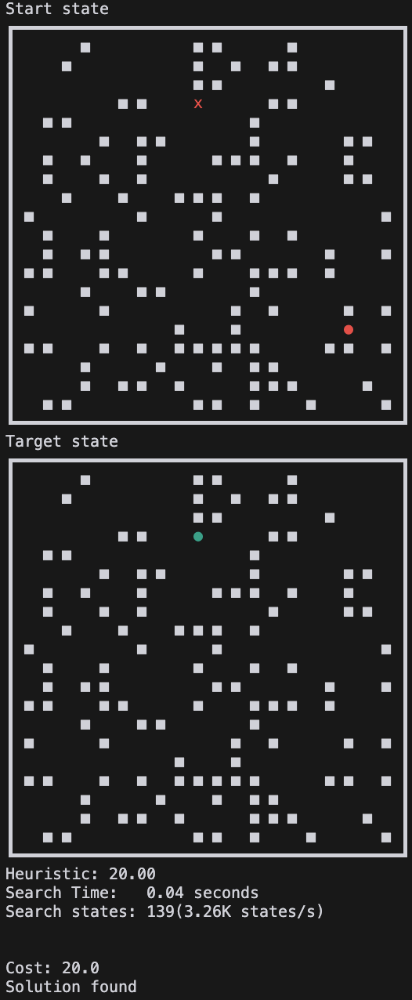
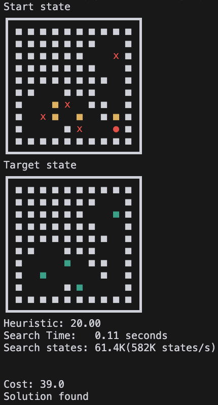
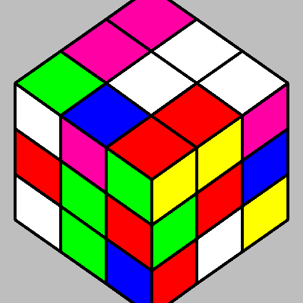

<div align="center">
  </img>
</div>

# JA<sup>xtar</sup>: GPU-accelerated Batched parallel A\* & Q\* solver in pure Jax!

JA<sup>xtar</sup> is a project with a JAX-native implementation of parallelizable a A\* & Q\* solver for neural heuristic search research.
This project is inspired by [mctx](https://github.com/google-deepmind/mctx) from Google DeepMind. If MCTS can be implemented entirely in pure JAX, why not A\*?

MCTS, or tree search, is used in many RL algorithmic techniques, starting with AlphaGo, but graph search (not tree search) doesn't seem to have received much attention. Nevertheless, there are puzzle‐solving algorithms that use neural heuristics like [DeepcubeA](https://github.com/forestagostinelli/DeepCubeA) with A\* or [Q\*](https://arxiv.org/abs/2102.04518)(graph search).

However, the most frustrating aspect of [my brief research (MSc)](https://drive.google.com/file/d/1clo8OmuXvIHhJzOUhH__0ZWzAamgVK84/view?usp=drive_link) in this area is the time it takes to pass information back and forth between the GPU and CPU.
When using a neural heuristic to evaluate a single node, the communication between the CPU and GPU, rather than the computation itself, can consume between 50% and 80% of the total processing time. Because of this communication overhead, DeepcubeA batches multiple nodes concurrently, which appears to work quite well.

However, these issues indicate that a more fundamental solution is needed. This led me to search for ways to perform A\* directly on the GPU, but I discovered that most implementations suffer from the following problems.

- They are written in pure c and cuda, which is not compatible with ML research
- They are written in jax or torch, but which are 2d grid environments or connectivity matrices, which cannot scale to an infinite number of different states that cannot all be held in memory
- The implementation itself is dependent on the definition of the state or problem.

To solve this problem, I decided to write code that adheres to the following principles and works.

- Only write in pure Jax
  - For ML research.
- Pure jax priority queue
  - A\* needs to have a priority queue because it expends nodes in the order of the node with the smallest sum of heuristic and cost
  - However, the heap used inside python uses list variables, which cannot be jitted, so we need to use a heap that can be iterated over in jax
- A hashable with a state and a hashtable that operates on it.
  - We need this to be able to know if a node in the A\* algorithm is closed, open, and what state its parent is in
  - If the state is a simple matter of parsing and indexing, we don't need to hash it, but if it's not and there are nearly infinite states, we need to hash each state to index it and access its unique value
- Everything is batched and parallelised
  - GPUs have a lot of cores, but they are very slow compared to CPUs. To overcome this, algorithms running on GPUs should be written as parallel as possible.
- The implementation should not change depending on the puzzle.
  - The implementation should be able to handle any puzzle that has a defined state and a defined action space.
  - This allows for the expansion of research and ensures that 'strict' behavior can be formalized in later implementations.

Specially written components in this project include:

- a hash_func_builder for convert defined states to hash keys
- a hashtable to lookup and insert in a parallel way
- a priority queue that can be batched, pushed and popped
- a fully jitted A\* algorithm for puzzles.

This project was a real pain in the arse to write, and I almost felt like I was doing acrobatics with Jax, but I managed to create a fully functional version, and hopefully it will inspire you to stumble upon something amazing when you travel to Jax.

## Result

We can find the optimal path using a jittable, batched A\* search as shown below. This is not a super blazingly fast result, but it can be well integrated with heuristics using neural networks.
The speed benchmarks below were measured on an Nvidia A100 40GB GPU. Correct operation was verified on an RTX4080 SUPER GPU, though performance was not formally measured.

### Test Run

```bash
$ python main.py astar
Start state
┏━━━┳━━━┳━━━┳━━━┓
┃ 5 ┃ E ┃ 2 ┃ 3 ┃
┣━━━╋━━━╋━━━╋━━━┫
┃ D ┃ B ┃ 9 ┃ 7 ┃
┣━━━╋━━━╋━━━╋━━━┫
┃ A ┃ F ┃ 4 ┃ C ┃
┣━━━╋━━━╋━━━╋━━━┫
┃   ┃ 8 ┃ 6 ┃ 1 ┃
┗━━━┻━━━┻━━━┻━━━┛
Target state
┏━━━┳━━━┳━━━┳━━━┓
┃ 1 ┃ 2 ┃ 3 ┃ 4 ┃
┣━━━╋━━━╋━━━╋━━━┫
┃ 5 ┃ 6 ┃ 7 ┃ 8 ┃
┣━━━╋━━━╋━━━╋━━━┫
┃ 9 ┃ A ┃ B ┃ C ┃
┣━━━╋━━━╋━━━╋━━━┫
┃ D ┃ E ┃ F ┃   ┃
┗━━━┻━━━┻━━━┻━━━┛
Heuristic: 33.00
Time:   0.70 seconds
Search states: 1.25M(1.78M states/s)

Cost: 49.0
Solution found
```

### Test vmapped run

```bash
$ python main.py astar --vmap_size 20
Vmapped A* search, multiple initial state solution
Start states
┏━━━┳━━━┳━━━┳━━━┓  ┏━━━┳━━━┳━━━┳━━━┓  ...              ┏━━━┳━━━┳━━━┳━━━┓  ┏━━━┳━━━┳━━━┳━━━┓
┃ 5 ┃ E ┃ 2 ┃ 3 ┃  ┃ 5 ┃ E ┃ 2 ┃ 3 ┃  (batch : (20,))  ┃ 5 ┃ E ┃ 2 ┃ 3 ┃  ┃ 5 ┃ E ┃ 2 ┃ 3 ┃
┣━━━╋━━━╋━━━╋━━━┫  ┣━━━╋━━━╋━━━╋━━━┫                   ┣━━━╋━━━╋━━━╋━━━┫  ┣━━━╋━━━╋━━━╋━━━┫
┃ D ┃ B ┃ 9 ┃ 7 ┃  ┃ D ┃ B ┃ 9 ┃ 7 ┃                   ┃ D ┃ B ┃ 9 ┃ 7 ┃  ┃ D ┃ B ┃ 9 ┃ 7 ┃
┣━━━╋━━━╋━━━╋━━━┫  ┣━━━╋━━━╋━━━╋━━━┫                   ┣━━━╋━━━╋━━━╋━━━┫  ┣━━━╋━━━╋━━━╋━━━┫
┃ A ┃ F ┃ 4 ┃ C ┃  ┃ A ┃ F ┃ 4 ┃ C ┃                   ┃ A ┃ F ┃ 4 ┃ C ┃  ┃ A ┃ F ┃ 4 ┃ C ┃
┣━━━╋━━━╋━━━╋━━━┫  ┣━━━╋━━━╋━━━╋━━━┫                   ┣━━━╋━━━╋━━━╋━━━┫  ┣━━━╋━━━╋━━━╋━━━┫
┃   ┃ 8 ┃ 6 ┃ 1 ┃  ┃   ┃ 8 ┃ 6 ┃ 1 ┃                   ┃   ┃ 8 ┃ 6 ┃ 1 ┃  ┃   ┃ 8 ┃ 6 ┃ 1 ┃
┗━━━┻━━━┻━━━┻━━━┛  ┗━━━┻━━━┻━━━┻━━━┛                   ┗━━━┻━━━┻━━━┻━━━┛  ┗━━━┻━━━┻━━━┻━━━┛
Target state
┏━━━┳━━━┳━━━┳━━━┓  ┏━━━┳━━━┳━━━┳━━━┓  ...              ┏━━━┳━━━┳━━━┳━━━┓  ┏━━━┳━━━┳━━━┳━━━┓
┃ 1 ┃ 2 ┃ 3 ┃ 4 ┃  ┃ 1 ┃ 2 ┃ 3 ┃ 4 ┃  (batch : (20,))  ┃ 1 ┃ 2 ┃ 3 ┃ 4 ┃  ┃ 1 ┃ 2 ┃ 3 ┃ 4 ┃
┣━━━╋━━━╋━━━╋━━━┫  ┣━━━╋━━━╋━━━╋━━━┫                   ┣━━━╋━━━╋━━━╋━━━┫  ┣━━━╋━━━╋━━━╋━━━┫
┃ 5 ┃ 6 ┃ 7 ┃ 8 ┃  ┃ 5 ┃ 6 ┃ 7 ┃ 8 ┃                   ┃ 5 ┃ 6 ┃ 7 ┃ 8 ┃  ┃ 5 ┃ 6 ┃ 7 ┃ 8 ┃
┣━━━╋━━━╋━━━╋━━━┫  ┣━━━╋━━━╋━━━╋━━━┫                   ┣━━━╋━━━╋━━━╋━━━┫  ┣━━━╋━━━╋━━━╋━━━┫
┃ 9 ┃ A ┃ B ┃ C ┃  ┃ 9 ┃ A ┃ B ┃ C ┃                   ┃ 9 ┃ A ┃ B ┃ C ┃  ┃ 9 ┃ A ┃ B ┃ C ┃
┣━━━╋━━━╋━━━╋━━━┫  ┣━━━╋━━━╋━━━╋━━━┫                   ┣━━━╋━━━╋━━━╋━━━┫  ┣━━━╋━━━╋━━━╋━━━┫
┃ D ┃ E ┃ F ┃   ┃  ┃ D ┃ E ┃ F ┃   ┃                   ┃ D ┃ E ┃ F ┃   ┃  ┃ D ┃ E ┃ F ┃   ┃
┗━━━┻━━━┻━━━┻━━━┛  ┗━━━┻━━━┻━━━┻━━━┛                   ┗━━━┻━━━┻━━━┻━━━┛  ┗━━━┻━━━┻━━━┻━━━┛
vmap astar
# search_result, solved, solved_idx =jax.vmap(astar_fn, in_axes=(None, 0, 0, None))(inital_search_result, states, filled, target)
Search Time:   6.17 seconds (x8.7/20)
Search states: 25.7M (4.16M states/s) (x2.3 faster)
Solution found: 100.00%
# this means astart_fn is completely vmapable and jitable
```

### A\* with neural heuristic model

```bash
$ python main.py astar -nn -h -p rubikscube -w 0.2
initializing jit
Time:  72.42 seconds
JIT compiled

...

Heuristic: 14.10

Search Time:   1.31 seconds
Search states: 1.51M(1.16M states/s)


Cost: 22.0
Solution found
```

### Q\* with neural Q model

```bash
$ python main.py qstar -nn -h -p rubikscube -w 0.2
initializing jit
Time:  60.01 seconds
JIT compiled

...
qvalues: 'l_cw': 16.9 | 'l_ccw': 17.5 | 'd_cw': 17.1 | 'd_ccw': 16.8 | 'f_cw': 17.4 | 'f_ccw': 17.9 | 'r_cw': 16.8 | 'r_ccw': 17.2 | 'b_cw': 17.3 | 'b_ccw': 16.3 | 'u_cw': 17.7 | 'u_ccw': 17.0
Search Time:   0.42 seconds
Search states: 1.46M(3.45M states/s)


Cost: 22.0
Solution found
```

## Puzzles

### Target available puzzle

| Rubikscube                                              | Slidepuzzle                                               | Lightsout                                             | Maze                                       | Sokoban                                          |
| ------------------------------------------------------- | --------------------------------------------------------- | ----------------------------------------------------- | ------------------------------------------ | ------------------------------------------------ |
|         |         |         |         |         |
|  |  |  |  |  |

### Target not available puzzle

These types of puzzles are not strictly the kind that are typically solved with A\*, but after some simple testing, it turns out that, depending on how the problem is defined, they can be solved. Furthermore, this approach can be extended to TSP and countless other COP problems, provided that with a good heuristic. The training method will need to be investigated further.

| Dotknot                                          |
| ------------------------------------------------ |
|         |
|  |

## Citation

Please use this citation to reference this project.

```bibtex
@software{kyuseokjung2024jaxtar,
  title = {JA^{xtar}: GPU-accelerated Batched parallel A* & Q* solver in pure Jax!},
  author = {Kyuseok Jung},
  url = {https://github.com/tinker495/JAxtar},
  year = {2024},
}
```
