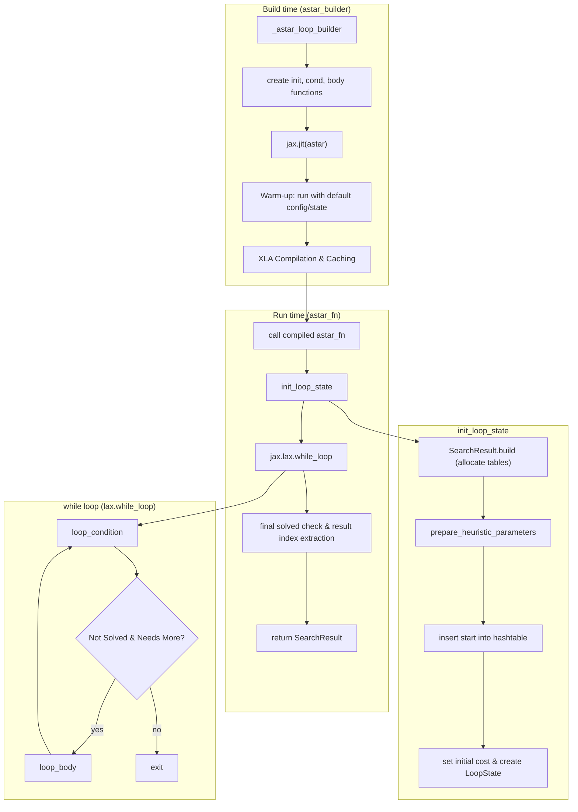
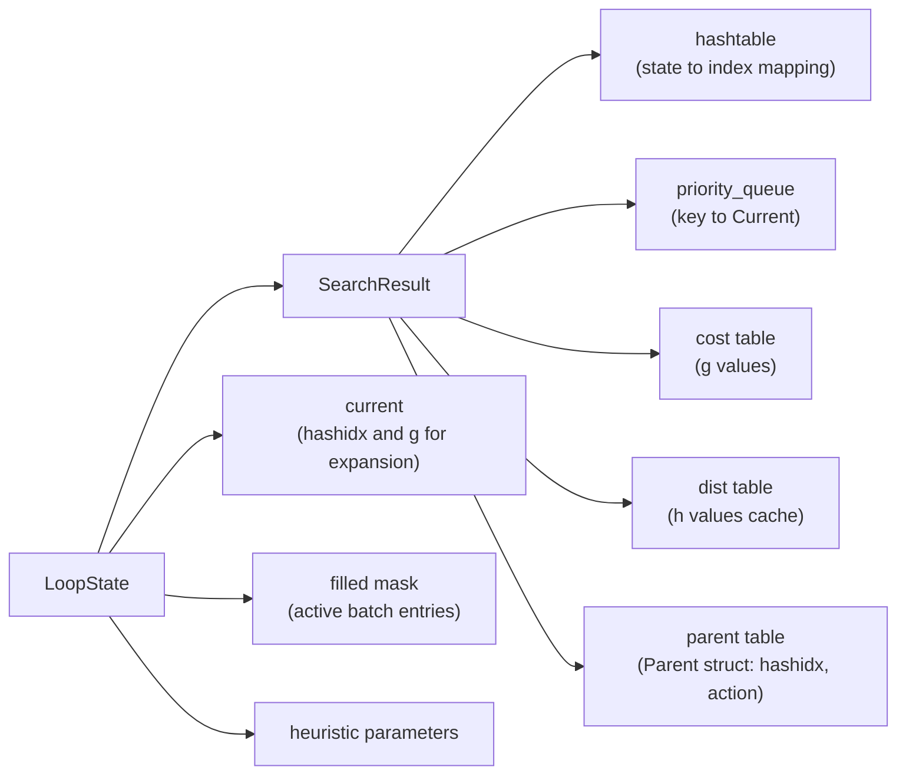
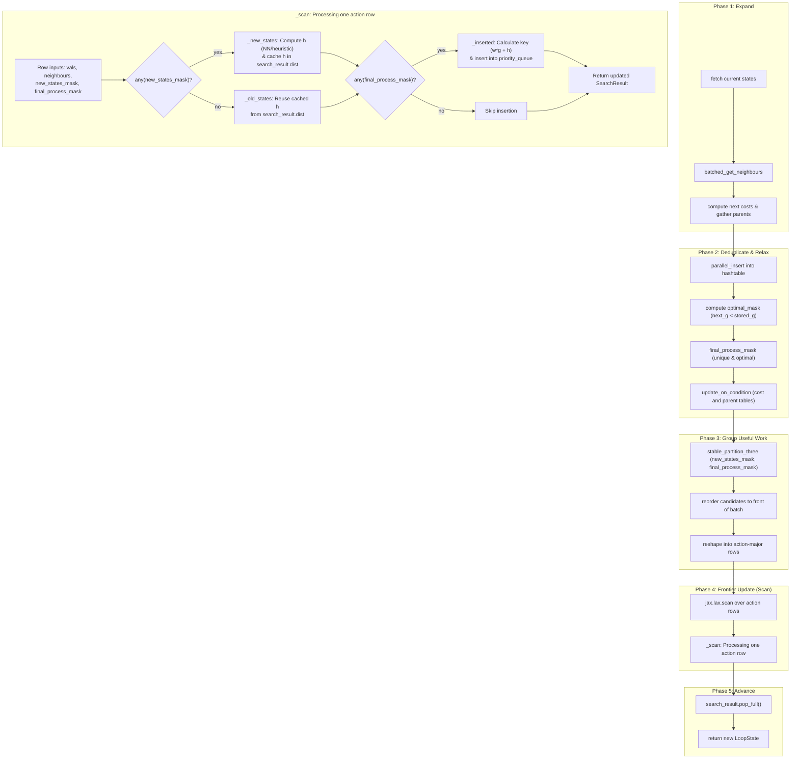
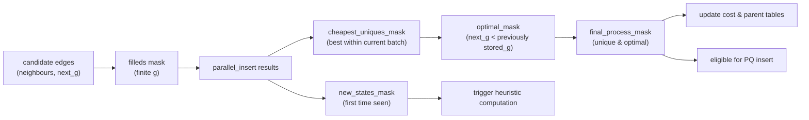

# A\* Command

The `astar` command solves a puzzle using the A\* search algorithm. A\* is a classic graph traversal and path-finding algorithm, which is often used in many fields of computer science due to its completeness, optimality, and optimal efficiency. This implementation is fully JIT-compiled with JAX for high performance on accelerators.

## Usage

The basic syntax for the `astar` command is:

```bash
python main.py astar [OPTIONS]
```

A common use case is to solve a specific puzzle with a neural network heuristic:

```bash
python main.py astar -p rubikscube -nn
```

## Options

The `astar` command uses a combination of option groups to configure the puzzle, search algorithm, heuristic, and visualization.

### Puzzle Options (`@puzzle_options`)

These options define the puzzle environment to be solved.

-   `-p, --puzzle`: Specifies the puzzle to solve.
    -   Type: `Choice`
    -   Default: `n-puzzle`
    -   Choices: `n-puzzle`, `rubikscube`, `slidepuzzle`, etc. (depends on configuration).
-   `-pargs, --puzzle_args`: JSON string for additional puzzle-specific arguments.
    -   Type: `String`
    -   Example: `python main.py astar -pargs '{"size": 4}'`
-   `-h, --hard`: If available, use a "hard" version of the puzzle.
    -   Type: `Flag`
-   `-s, --seeds`: A comma-separated list of seeds for generating initial puzzle states. Using multiple seeds will run the solver multiple times.
    -   Type: `String`
    -   Default: `"0"`

### Search Options (`@search_options`)

These options control the behavior of the A\* search algorithm itself.

-   `-m, --max_node_size`: The maximum number of nodes to explore. Supports scientific notation.
    -   Type: `String`
-   `-b, --batch_size`: The number of nodes to process in a single batch on the GPU.
    -   Type: `Integer`
-   `-w, --cost_weight`: The weight `w` for the path cost in `f(n) = w * g(n) + h(n)`. A value of `1.0` is standard A\*, while a lower value (< 1.0) prioritizes nodes closer to the goal (greedy search), and a higher value (> 1.0) prioritizes exploring cheaper paths.
    -   Type: `Float`
-   `-pr, --pop_ratio`: Ratio for popping nodes from the priority queue.
    -   Type: `Float`
-   `-vm, --vmap_size`: The number of different initial states to solve in parallel using `jax.vmap`.
    -   Type: `Integer`
-   `--debug`: Disables JIT compilation for easier debugging.
    -   Type: `Flag`
-   `--profile`: Enables `jax.profiler` and saves a trace to `tmp/tensorboard`.
    -   Type: `Flag`
-   `--show_compile_time`: Prints the JIT compilation time.
    -   Type: `Flag`

### Heuristic Options (`@heuristic_options`)

These options determine which heuristic function to use for guiding the search.

-   `-nn, --neural_heuristic`: Use a pre-trained neural network as the heuristic function. If not set, a default, non-ML heuristic is used.
    -   Type: `Flag`
-   `--param-path`: Path to the heuristic parameter file.
    -   Type: `String`
-   `--model-type`: Type of the heuristic model.
    -   Type: `String`

### Visualization Options (`@visualize_options`)

These options control how the final solution path is displayed.

-   `-vt, --visualize_terminal`: Renders the solution path step-by-step in the terminal.
    -   Type: `Flag`
-   `-vi, --visualize_imgs`: Generates an image for each step of the solution and saves them, along with a GIF animation, in a timestamped folder within `tmp/`.
    -   Type: `Flag`
-   `-mt, --max_animation_time`: Sets the maximum duration for the generated GIF animation, in seconds. The frame rate is adjusted to fit this duration.
    -   Type: `Integer`
    -   Default: `10`

## Implementation Notes (JAxtar/stars/astar.py)

This section documents the actual control flow and data flow in `JAxtar/stars/astar.py`.
The implementation is a batched, JIT-compiled A* variant built around two JAX-native data
structures inside `SearchResult`:

- `hashtable`: state deduplication + index assignment (stable IDs for states)
- `priority_queue`: frontier ordering by `key = cost_weight * g + h`

The core loop is built by `_astar_loop_builder(...)` and executed by `jax.lax.while_loop`.

### High-Level Control Flow



### Data Structures At A Glance



### Loop Body Data Flow (One Iteration)

The loop body expands the current batch, deduplicates candidate next states in parallel,
updates best-known `g` costs and parent pointers, (re-)inserts improved candidates into the
priority queue using `f = cost_weight * g + h`, then pops the next batch.

Key implementation details from `JAxtar/stars/astar.py`:

- Neighbour generation is fully batched: `puzzle.batched_get_neighbours(solve_config, states, filled)`
- Parent tracking is vectorized (`Parent(hashidx=..., action=...)`) and stored per state index
- Hash table insertion is parallel (`hashtable.parallel_insert`) and returns multiple masks
  used to filter out duplicates and non-optimal paths
- Heuristic is cached in `search_result.dist`; newly inserted states compute `h` via
  `variable_batch_switcher_builder(heuristic.batched_distance, ...)`
- `stable_partition_three(...)` reorders flattened candidates to group useful work early
  (improves efficiency by creating denser batches for subsequent operations)



### Mask Pipeline



### JIT Compilation Strategy

`astar_builder(...)` returns a JIT-compiled function (`astar_fn = jax.jit(astar)`).
To avoid extremely long compilation times from tracing complex puzzle logic on real inputs,
it triggers compilation once using `puzzle.SolveConfig.default()` and `puzzle.State.default()`.

This means:

- First call compiles and caches the XLA program.
- Subsequent calls reuse the compiled program as long as shapes/dtypes/static args match.
