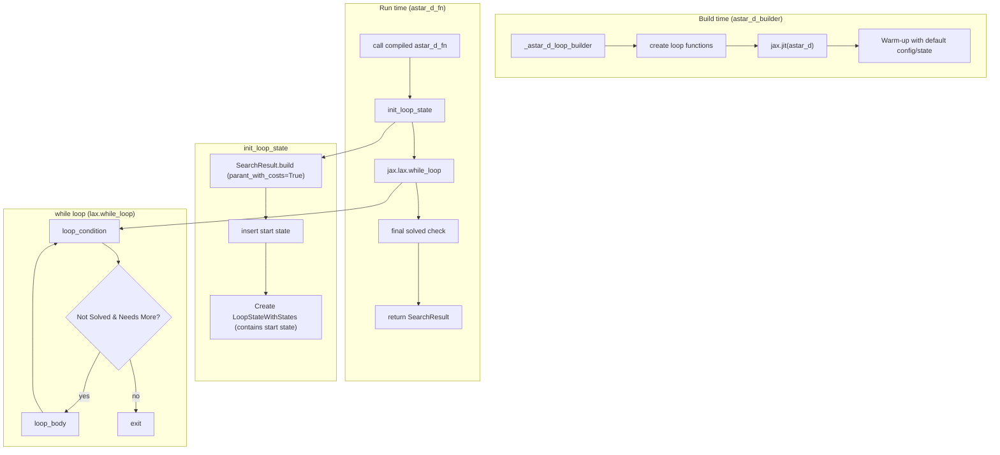
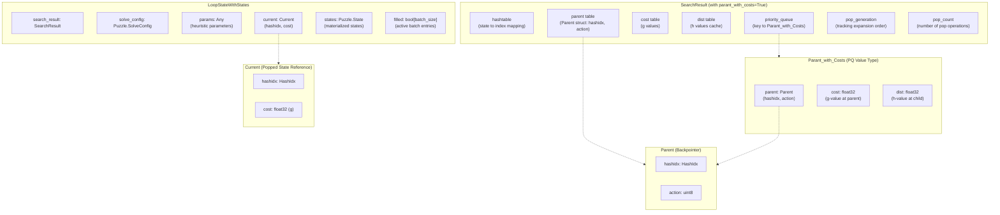
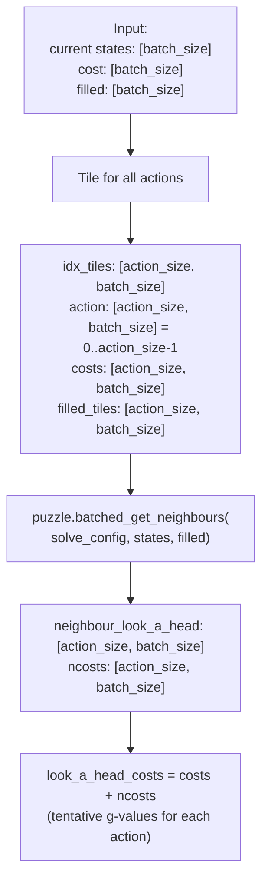
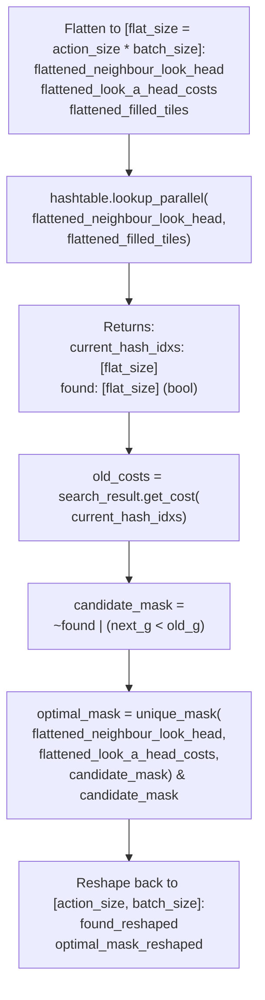
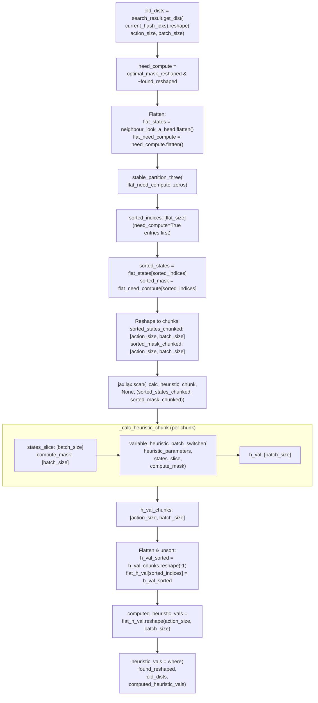
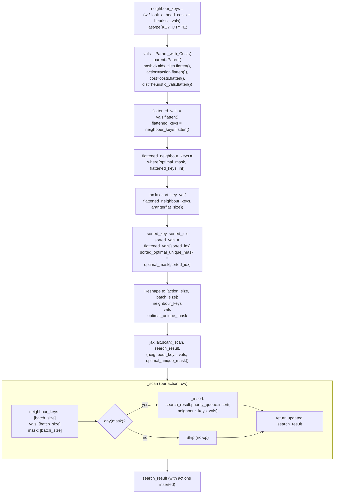
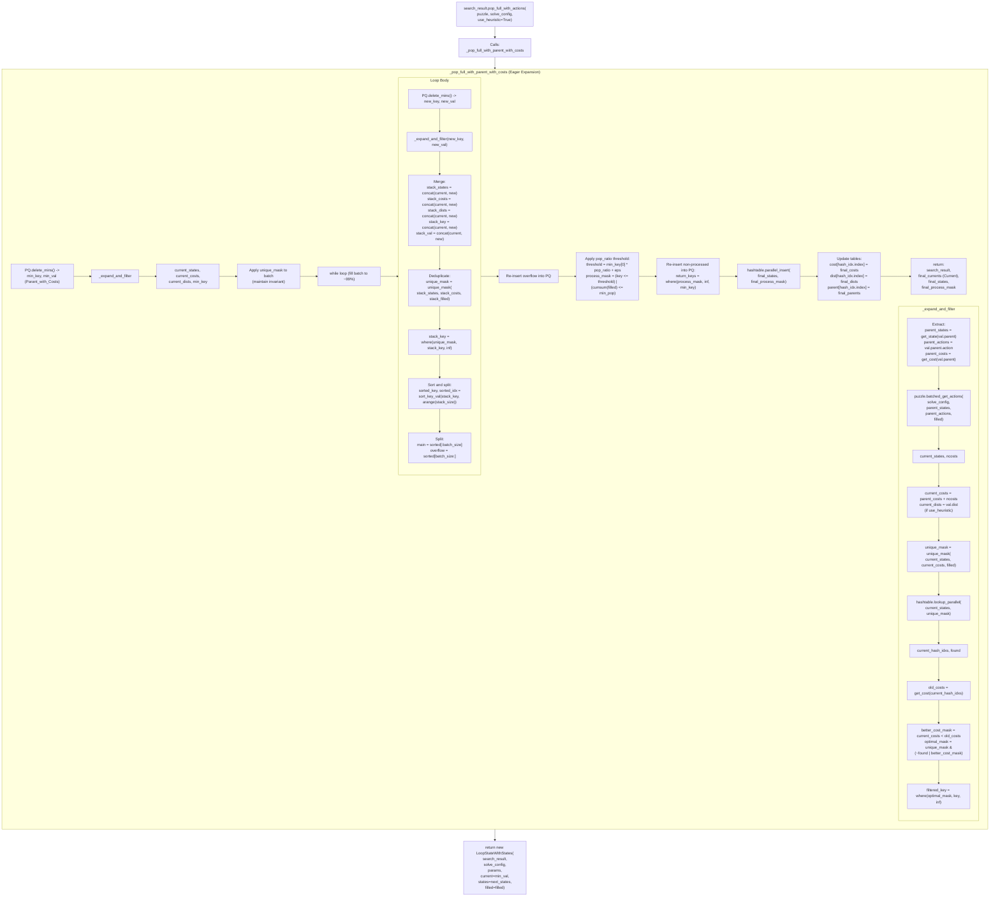
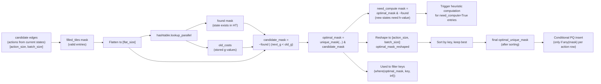
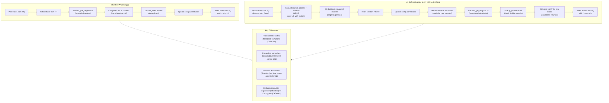

# A\* Deferred Command (`astar_d`)

The `astar_d` command solves a puzzle using the A\* Deferred search algorithm. This is a variation of A\* where node expansion is deferred, which can be beneficial in certain search spaces or when using specific types of heuristics (e.g., heavy heuristics). It maintains the optimality guarantees of A\* under consistent heuristics.

## Usage

The basic syntax for the `astar_d` command is:

```bash
python main.py astar_d [OPTIONS]
```

Example:

```bash
python main.py astar_d -p rubikscube -nn
```

## Options

The `astar_d` command uses the same option groups as the standard `astar` command.

### Puzzle Options (`@puzzle_options`)

These options define the puzzle environment to be solved.

-   `-p, --puzzle`: Specifies the puzzle to solve.
    -   Type: `Choice`
    -   Default: `n-puzzle`
-   `-pargs, --puzzle_args`: JSON string for additional puzzle-specific arguments.
    -   Type: `String`
-   `-h, --hard`: If available, use a "hard" version of the puzzle.
    -   Type: `Flag`
-   `-s, --seeds`: A comma-separated list of seeds for generating initial puzzle states.
    -   Type: `String`
    -   Default: `"0"`

### Search Options (`@search_options`)

These options control the behavior of the search algorithm.

-   `-m, --max_node_size`: The maximum number of nodes to explore.
    -   Type: `String`
    -   Default: `2e6`
-   `-b, --batch_size`: The number of nodes to process in a single batch.
    -   Type: `Integer`
    -   Default: `10000`
-   `-w, --cost_weight`: The weight `w` for the path cost.
    -   Type: `Float`
    -   Default: `0.9`
-   `-pr, --pop_ratio`: Ratio for popping nodes from the priority queue.
    -   Type: `Float`
    -   Default: `inf`
-   `-vm, --vmap_size`: The number of different initial states to solve in parallel.
    -   Type: `Integer`
    -   Default: `1`
-   `--debug`: Disables JIT compilation.
    -   Type: `Flag`
-   `--profile`: Enables profiler.
    -   Type: `Flag`
-   `--show_compile_time`: Prints compilation time.
    -   Type: `Flag`

### Heuristic Options (`@heuristic_options`)

-   `-nn, --neural_heuristic`: Use a pre-trained neural network as the heuristic function.
    -   Type: `Flag`
-   `--param-path`: Path to the heuristic parameter file.
    -   Type: `String`
-   `--model-type`: Type of the heuristic model.
    -   Type: `String`

### Visualization Options (`@visualize_options`)

-   `-vt, --visualize_terminal`: Renders the solution path in the terminal.
    -   Type: `Flag`
-   `-vi, --visualize_imgs`: Generates images and GIF for the solution.
    -   Type: `Flag`
-   `-mt, --max_animation_time`: Max duration for GIF.
    -   Type: `Integer`

## Implementation & Architecture (`JAxtar/stars/astar_d.py`)

A* Deferred is a refined variant designed to handle expensive heuristic evaluations and high branching factors by delaying state generation.

### Key Differences from Standard A*

| Feature | Standard A* (`astar.py`) | A* Deferred (`astar_d.py`) |
| :--- | :--- | :--- |
| **Expansion** | Immediate: Children generated in `loop_body`. | Deferred: Children generated in `pop_full_with_actions` *after* being popped. |
| **PQ Contents** | Fully generated states with $f = g + h$. | Actions/Edges with priorities (often parent's $f$ or look-ahead $f$). |
| **Heuristic Eval** | Every generated child is evaluated immediately. | Only popped or promising children are evaluated (via pruning). |
| **Best For** | Cheap transitions, low branching factor. | Expensive heuristics, wide search trees. |

### High-Level Control Flow



### Data Structures At A Glance

The deferred variant uses a modified `SearchResult` and `LoopStateWithStates` that differ from standard A* in key ways:



**Key Differences from Standard A\***:
- **PQ stores actions/edges**: `Parant_with_Costs` contains the parent state + action + costs, not fully expanded states
- **Materialized states in loop**: `LoopStateWithStates.states` holds the actual states after `pop_full_with_actions`
- **Deferred expansion**: Child states are generated *after* being popped, not during parent expansion

### Loop Body Data Flow (One Iteration)

The deferred implementation in JAxtar defaults to `look_ahead_pruning=True`, which proactively simulates neighbors to avoid inserting non-optimal actions into the priority queue. This is a key optimization that distinguishes this implementation from canonical A* deferred.

The loop body follows a pipeline of five distinct phases:

```mermaid
flowchart TD
  subgraph Phase1["Phase 1: Look-ahead Expansion"]
    S1["Input: current states (batch_size)"] --> S2["puzzle.batched_get_neighbours"]
    S2 --> S3["neighbour_look_a_head: [action_size, batch_size]\nncosts: [action_size, batch_size]"]
    S3 --> S4["look_a_head_costs = costs + ncosts\n(tentative g-values)"]
  end

  subgraph Phase2["Phase 2: Deduplicate & Prune"]
    S4 --> S5["flatten to [action_size * batch_size]"]
    S5 --> S6["hashtable.lookup_parallel\n(check if states exist)"]
    S6 --> S7["old_costs = search_result.get_cost(current_hash_idxs)"]
    S7 --> S8["candidate_mask = ~found | (next_g < old_g)"]
    S8 --> S9["optimal_mask = unique_mask & candidate_mask\n(best unique candidates)"]
  end

  subgraph Phase3["Phase 3: Pack & Compute Heuristics"]
    S9 --> S10["need_compute = optimal_mask & ~found\n(new states need h-value)"]
    S10 --> S11["stable_partition_three\n(pack need_compute=True to front)"]
    S11 --> S12["reshape to [action_size, batch_size] chunks"]
    S12 --> S13["jax.lax.scan over chunks"]
    S13 --> S14["_calc_heuristic_chunk:\nvariable_heuristic_batch_switcher"]
    S14 --> S15["heuristic_vals = where(found, old_dists, computed)"]
  end

  subgraph Phase4["Phase 4: Create & Insert Actions"]
    S15 --> S16["neighbour_keys = w*look_a_head_costs + h"]
    S16 --> S17["vals = Parant_with_Costs(\nparent=Parent(hashidx, action),\ncost=costs,\ndist=heuristic_vals)"]
    S17 --> S18["sort by key, keep best candidates"]
    S18 --> S19["jax.lax.scan: insert into PQ\n(conditional on optimal_unique_mask)"]
  end

  subgraph Phase5["Phase 5: Pop & Materialize Next Batch"]
    S19 --> S20["search_result.pop_full_with_actions"]
    S20 --> S21["Inside pop_full_with_actions:\n1. Pop Parant_with_Costs from PQ\n2. Expand (parent, action) -> child states\n3. Deduplicate expanded children\n4. Insert children into hashtable\n5. Update cost/dist/parent tables"]
    S21 --> S22["return new LoopStateWithStates\n(with materialized next states)"]
  end

  S4 --> S5
  S9 --> S10
  S15 --> S16
  S19 --> S20
```



**Key Implementation Details**:
- **Look-ahead simulation**: All actions are simulated *before* PQ insertion to filter non-optimal paths
- **Batch packing**: `stable_partition_three` groups states needing heuristic computation for efficient batching
- **Conditional heuristic**: Only new states (`~found`) compute h-values; existing states reuse cached values
- **Chunked scanning**: Heuristic computation is split into `action_size` chunks to respect `max_batch_size`
- **Deferred materialization**: Full states are only created in `pop_full_with_actions`, not during expansion

### Detailed Phase Breakdowns

#### Phase 1: Look-ahead Expansion



#### Phase 2: Deduplicate & Prune



#### Phase 3: Pack & Compute Heuristics



#### Phase 4: Create & Insert Actions



#### Phase 5: Pop & Materialize Next Batch



### pop_full_with_actions: Eager Expansion & Deduplication

Unlike standard A*, the `pop_full_with_actions` method is **critical** to the deferred variant. It performs eager expansion *inside* the pop operation to ensure batch quality:

**Key Steps**:
1. **Pop actions from PQ**: Retrieve `Parant_with_Costs` (parent + action + costs)
2. **Expand to states**: Use `puzzle.batched_get_actions(parent_states, parent_actions)` to materialize child states
3. **Deduplicate**: Apply `unique_mask` and lookup in hashtable to filter non-optimal/duplicate children
4. **Fill batch**: Loop to accumulate enough unique, optimal children (respecting `pop_ratio`)
5. **Insert into hashtable**: Add new states and update cost/dist/parent tables
6. **Return materialized states**: Unlike standard A*, return the actual states (not just hash indices)

**Why Eager Expansion?**

In highly reversible environments (e.g., Rubik's Cube), popping actions can yield many duplicate children (e.g., undoing the previous move). Without eager expansion, the batch would be "starved" — filled with duplicates that provide no useful work.

By expanding and deduplicating *inside* the pop, we guarantee the returned batch contains only unique, optimal states ready for the next iteration.

### Mask Pipeline (Look-ahead Pruning)

The mask pipeline in A* Deferred with look-ahead pruning is more complex than standard A*, as it filters candidates at multiple stages:



**Mask Semantics**:
- **filled_tiles**: Valid batch entries (finite g-values)
- **found**: State already exists in hashtable (may need cost update)
- **candidate_mask**: States that are either new OR offer better cost
- **optimal_mask**: Best unique candidates (no duplicates within batch)
- **need_compute**: New states requiring heuristic evaluation
- **optimal_unique_mask**: Final mask after sorting (controls PQ insertion)

### Standard A* vs A* Deferred: Data Flow Comparison



### JIT Compilation Strategy

Like standard A*, `astar_d_builder(...)` returns a JIT-compiled function (`astar_d_fn = jax.jit(astar_d)`). The compilation strategy is identical:

- **Warm-up compilation**: First call uses `puzzle.SolveConfig.default()` and `puzzle.State.default()` to trigger XLA compilation with simple inputs
- **Cache reuse**: Subsequent calls reuse the compiled program (same shapes/dtypes/static args)
- **Why empty inputs?**: Real puzzles cause extremely long compilation times due to complex traced logic; empty inputs allow fast specialization

**Compilation Time Notes**:
- A* Deferred typically takes **longer to compile** than standard A* due to:
  - More complex loop body (look-ahead simulation + packing)
  - Nested scans (chunked heuristic computation + PQ insertion)
  - Eager expansion logic in `pop_full_with_actions` (expand-deduplicate loop)
- Use `--show_compile_time` flag to measure compilation overhead
