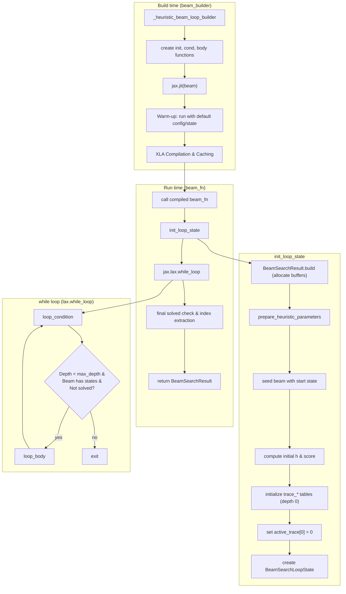
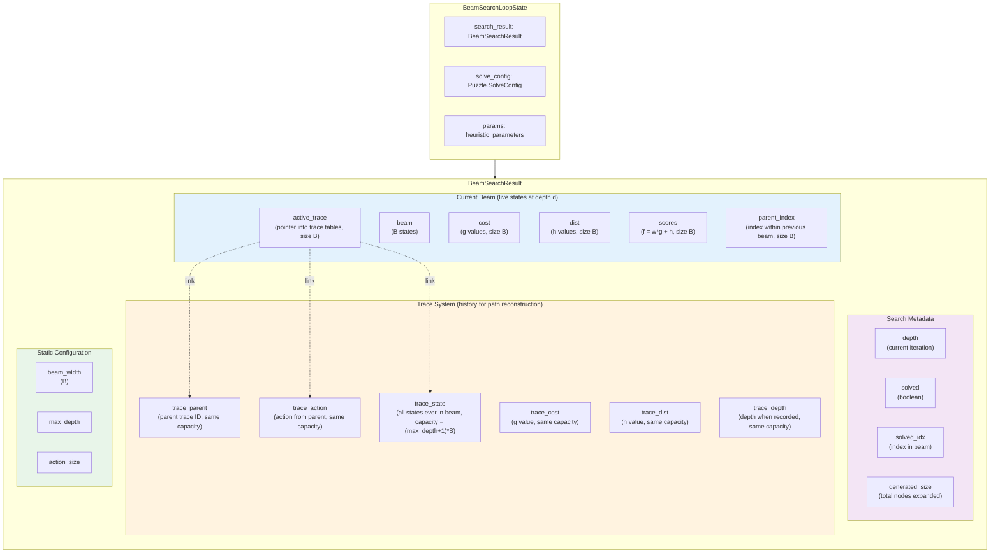
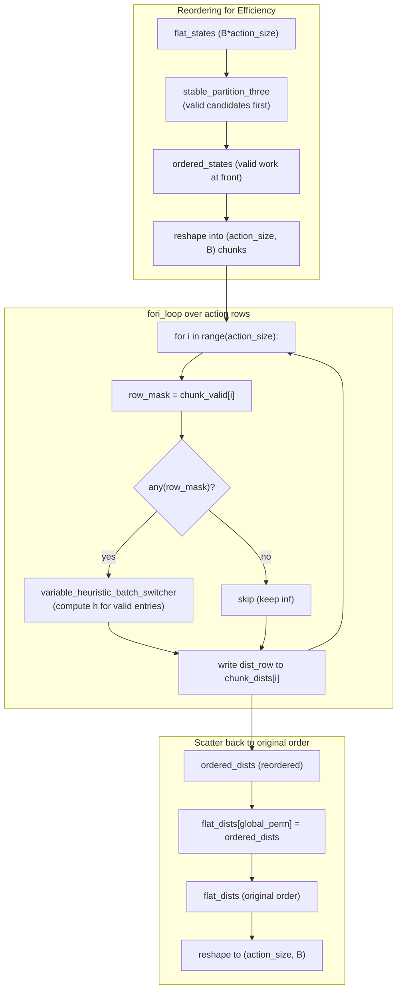
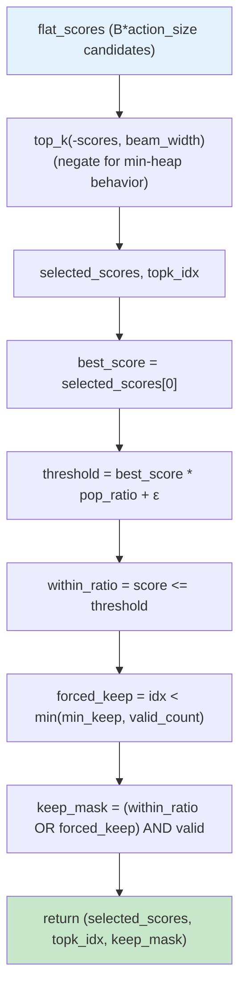
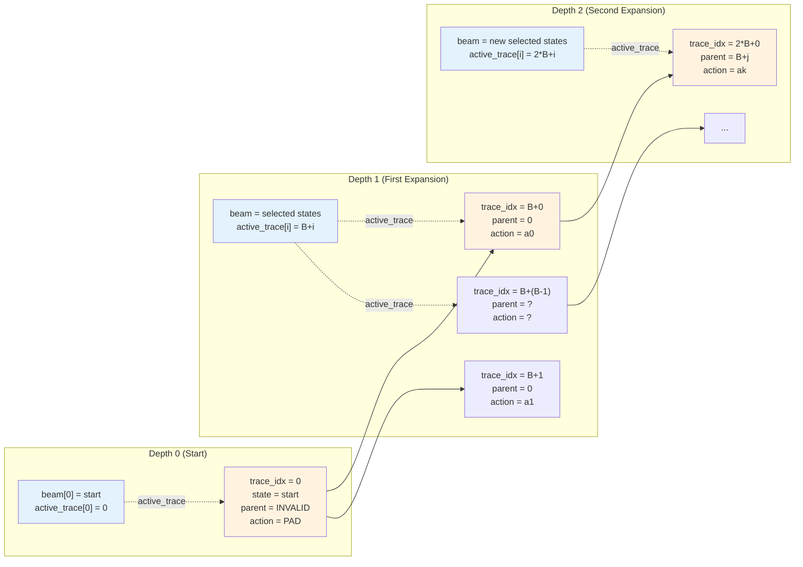
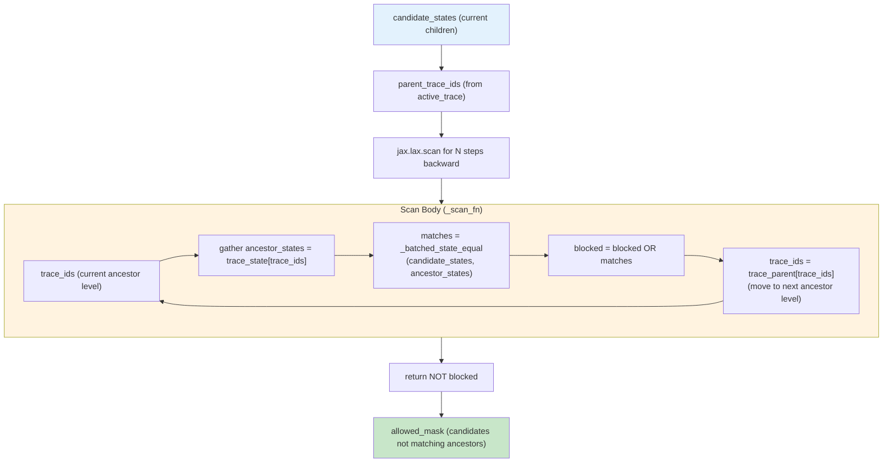
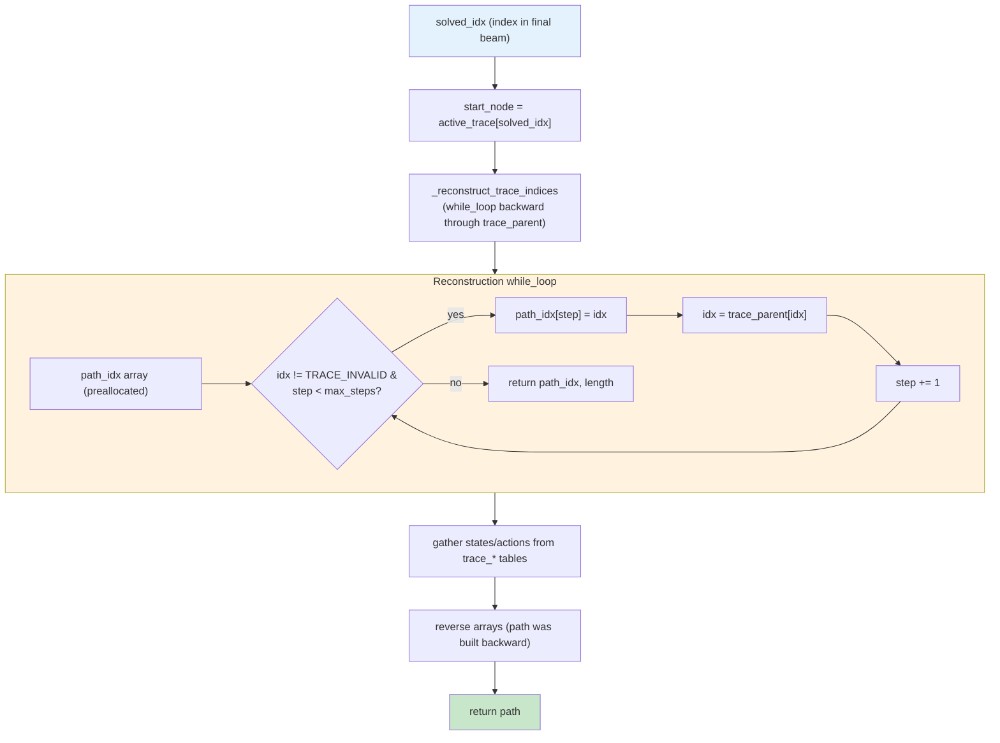

# Beam Search Command (`beam`)

The `beam` command solves a puzzle using Beam Search. Beam Search is a heuristic search algorithm that explores a graph by expanding the most promising node in a limited set. It is like a breadth-first search that optimizes memory usage by only storing a fixed number of best states at each level (the "beam width"). It is not guaranteed to find the optimal solution but is often much faster and more memory-efficient than A*.

## Usage

The basic syntax for the `beam` command is:

```bash
python main.py beam [OPTIONS]
```

Example:

```bash
python main.py beam -p rubikscube -nn -b 10000
```

## Options

The `beam` command uses option groups similar to `astar`, but the search behavior is governed by beam search principles.

### Puzzle Options (`@puzzle_options`)

-   `-p, --puzzle`: Specifies the puzzle to solve.
    -   Type: `Choice`
    -   Default: `n-puzzle`
-   `-pargs, --puzzle_args`: JSON string for additional puzzle-specific arguments.
    -   Type: `String`
-   `-h, --hard`: If available, use a "hard" version of the puzzle.
    -   Type: `Flag`
-   `-s, --seeds`: A comma-separated list of seeds for generating initial puzzle states.
    -   Type: `String`
    -   Default: `"0"`

### Search Options (`@search_options`)

For Beam Search, some options have specific implications:

-   `-b, --batch_size`: **Critical for Beam Search.** This effectively sets the **Beam Width** (or a multiple of it, depending on implementation details). It limits the number of nodes kept at each step.
    -   Type: `Integer`
    -   Default: `10000`
-   `-m, --max_node_size`: The maximum number of nodes to explore.
    -   Type: `String`
-   `-w, --cost_weight`: The weight `w` for the path cost.
    -   Type: `Float`
-   `-pr, --pop_ratio`: Ratio for popping nodes.
    -   Type: `Float`
-   `-vm, --vmap_size`: The number of different initial states to solve in parallel.
    -   Type: `Integer`
-   `--debug`: Disables JIT compilation.
    -   Type: `Flag`
-   `--profile`: Enables profiler.
    -   Type: `Flag`
-   `--show_compile_time`: Prints compilation time.
    -   Type: `Flag`

### Heuristic Options (`@heuristic_options`)

-   `-nn, --neural_heuristic`: Use a pre-trained neural network as the heuristic function.
    -   Type: `Flag`
-   `--param-path`: Path to the heuristic parameter file.
    -   Type: `String`
-   `--model-type`: Type of the heuristic model.
    -   Type: `String`

### Visualization Options (`@visualize_options`)

-   `-vt, --visualize_terminal`: Renders the solution path in the terminal.
    -   Type: `Flag`
-   `-vi, --visualize_imgs`: Generates images and GIF for the solution.
    -   Type: `Flag`
-   `-mt, --max_animation_time`: Max duration for GIF.
    -   Type: `Integer`

---

## Implementation Notes (JAxtar/beamsearch/heuristic_beam.py)

This section documents the actual control flow and data flow in `JAxtar/beamsearch/heuristic_beam.py`.
Beam Search is a greedy BFS variant that only keeps the top-B best nodes (where B is the `beam_width`) at each depth. This prevents search space explosion while maintaining a high chance of finding a solution.

Unlike A*, beam search operates **without a global hash table or priority queue**. Instead, it uses:

- `beam`: Current set of B active states (only current depth, not historical)
- `trace_*` tables: History buffers for path reconstruction across all depths
- `select_beam()`: Top-k selection by score for beam pruning
- `non_backtracking_mask()`: Local cycle prevention without global deduplication

The core loop is built by `_heuristic_beam_loop_builder(...)` and executed by `jax.lax.while_loop`.

### High-Level Control Flow



### Data Structures At A Glance



Key differences from A*:
- **No global hashtable**: Beam search does not maintain a global mapping of states to indices. States are deduplicated only within each batch of candidates before beam selection.
- **No priority queue**: Instead of a heap-based frontier, beam search uses `select_beam()` (top-k selection) to pick the B best candidates by score.
- **Trace system**: Since old beams are discarded, a trace history is maintained to enable path reconstruction. `active_trace[i]` points to an index in `trace_*` arrays, which store the full lineage.

### Loop Body Data Flow (One Iteration)

The loop body expands all B states in the current beam, deduplicates candidates in-batch,
applies non-backtracking filtering, selects the top-B candidates by score, updates the trace
history, and advances to the next depth.

Key implementation details from `JAxtar/beamsearch/heuristic_beam.py`:

- Neighbor generation is fully batched: `puzzle.batched_get_neighbours(solve_config, beam_states, filled_mask)`
- Candidate costs are computed: `child_costs = base_costs + transition_cost`
- **In-batch deduplication**: `xnp.unique_mask(flat_states, key=flat_cost, filled=flat_valid)` keeps only the best instance of each state within the current candidates
- **Non-backtracking filter**: `non_backtracking_mask()` rejects candidates that match any of their N most recent ancestors in the trace
- **Heuristic computation**: Candidates are reordered with `stable_partition_three()` to group valid work, then heuristics are computed in chunks via `jax.lax.fori_loop` over action rows
- **Beam selection**: `select_beam(scores, beam_width, pop_ratio, min_keep)` performs top-k selection with optional ratio-based pruning
- **Final deduplication**: After selection, a second `xnp.unique_mask()` ensures no duplicate states in the new beam
- **Trace update**: New beam states are recorded in `trace_*` tables at indices `(depth+1) * beam_width + slot`

```mermaid
flowchart TD
  subgraph Phase1["Phase 1: Expand Current Beam"]
    S1["fetch beam states (B states)"] --> S2["batched_get_neighbours<br/>(generates B x action_size candidates)"]
    S2 --> S3["compute child_costs = base_costs + transition_cost"]
    S3 --> S4["compute child_valid mask<br/>(filled & finite cost)"]
  end

  subgraph Phase2["Phase 2: In-Batch Deduplication"]
    S5["flatten candidates to (B * action_size,)"] --> S6["xnp.unique_mask<br/>(keep cheapest duplicate within batch)"]
    S6 --> S7["update child_valid with unique_mask"]
  end

  subgraph Phase3["Phase 3: Non-Backtracking Filter"]
    S8["broadcast parent_trace IDs<br/>(active_trace for each candidate)"] --> S9["non_backtracking_mask<br/>(scan through ancestor chain)"]
    S9 --> S10["reject candidates matching<br/>any of N recent ancestors"]
    S10 --> S11["update child_valid with allowed_mask"]
  end

  subgraph Phase4["Phase 4: Reorder & Compute Heuristics"]
    S12["stable_partition_three<br/>(move valid candidates to front)"] --> S13["reshape into action-major rows<br/>(action_size x B)"]
    S13 --> S14["jax.lax.fori_loop over action rows"]
    S14 --> S15["_compute_chunk:<br/>batched_distance for valid row members"]
    S15 --> S16["scatter results back to flattened order"]
  end

  subgraph Phase5["Phase 5: Scoring & Selection"]
    S17["compute scores = w*g + h"] --> S18["select_beam<br/>(top-k by score with pop_ratio pruning)"]
    S18 --> S19["gather selected states/costs/dists/actions/parents"]
    S19 --> S20["final xnp.unique_mask<br/>(deduplicate within selected B)"]
    S20 --> S21["update selected_valid with unique_valid"]
  end

  subgraph Phase6["Phase 6: Trace Update & Advance"]
    S22["gather parent_trace_ids<br/>(from previous beam's active_trace)"] --> S23["compute next_trace_ids<br/>(depth+1) * beam_width + slot"]
    S23 --> S24["update trace_parent, trace_action,<br/>trace_cost, trace_dist, trace_depth, trace_state<br/>at next_trace_ids"]
    S24 --> S25["set active_trace = next_trace_ids<br/>(or TRACE_INVALID if not valid)"]
    S25 --> S26["update beam, cost, dist, scores, parent_index"]
    S26 --> S27["increment depth & generated_size"]
    S27 --> S28["return new BeamSearchLoopState"]
  end

  S4 --> S5
  S7 --> S8
  S11 --> S12
  S16 --> S17
  S21 --> S22
```



### Detailed Phase Breakdowns

#### Phase 4: Heuristic Computation with Chunking

Since candidates are sparse (many invalid entries), the implementation reorders them to pack valid work into the front of batches, improving GPU utilization.



#### Phase 5: Beam Selection (select_beam)

The `select_beam` function performs top-k selection with optional ratio-based pruning to focus on promising candidates.



- `pop_ratio`: Allows pruning candidates much worse than the best. E.g., `pop_ratio=1.1` keeps only candidates within 10% of the best score.
- `min_keep`: Ensures at least N candidates survive (if available), even if they exceed the ratio threshold.

#### Phase 6: Trace System Update

The trace system maintains a history of all states that have ever been in the beam, enabling path reconstruction without a global hash table.



Key trace mechanics:
1. **Trace capacity**: `(max_depth + 1) * beam_width` preallocated slots
2. **Trace index formula**: `trace_idx = depth * beam_width + slot_in_beam`
3. **Parent linking**: `trace_parent[trace_idx]` points to parent's trace_idx from previous depth
4. **Action recording**: `trace_action[trace_idx]` stores the action taken from parent
5. **State storage**: `trace_state[trace_idx]` stores the actual state for non-backtracking checks and path reconstruction
6. **Active mapping**: `active_trace[i]` maps current beam slot i to its trace_idx

When a solution is found, `get_solved_path()` uses `_reconstruct_trace_indices()` to walk backward through `trace_parent` links, collecting states and actions.

### Non-Backtracking Filter

Beam search can get stuck in local loops (e.g., A -> B -> A -> B -> ...) without global deduplication. The `non_backtracking_steps` parameter prevents this by rejecting candidates that match any of their N most recent ancestors.



Algorithm:
1. Start with `parent_trace_ids` (immediate parents of candidates)
2. For each lookback step:
   - Fetch ancestor states from `trace_state[trace_ids]`
   - Check equality with `candidate_states`
   - Mark matches as blocked
   - Move to next ancestor level via `trace_parent[trace_ids]`
3. Return mask of candidates that don't match any ancestor

Example with `non_backtracking_steps=3`:
- Candidate C is rejected if it equals parent P, grandparent GP, or great-grandparent GGP
- This prevents loops like A -> B -> A (2-cycle) or A -> B -> C -> A (3-cycle)
- Does NOT prevent longer cycles (requires global hashtable for that)

### Trace System Path Reconstruction



The reconstruction logic:
1. **Find starting point**: `active_trace[solved_idx]` gives the trace_idx of the solution
2. **Walk backward**: Follow `trace_parent` links until reaching `TRACE_INVALID` (the root)
3. **Collect path**: Record trace indices in `path_idx` array
4. **Gather data**: Use `path_idx` to index into `trace_state`, `trace_action`, etc.
5. **Reverse**: Path was built from goal to start, so reverse it

This approach avoids storing full paths for every beam state, trading off storage for reconstruction time.

### JIT Compilation Strategy

`beam_builder(...)` returns a JIT-compiled function (`beam_fn = jax.jit(beam)`).
To avoid extremely long compilation times from tracing complex puzzle logic on real inputs,
it triggers compilation once using `puzzle.SolveConfig.default()` and `puzzle.State.default()`.

This means:

- First call compiles and caches the XLA program.
- Subsequent calls reuse the compiled program as long as shapes/dtypes/static args match.
