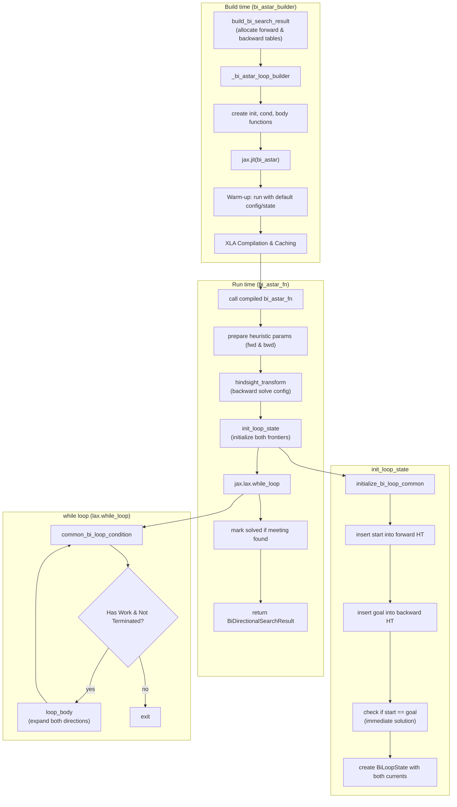
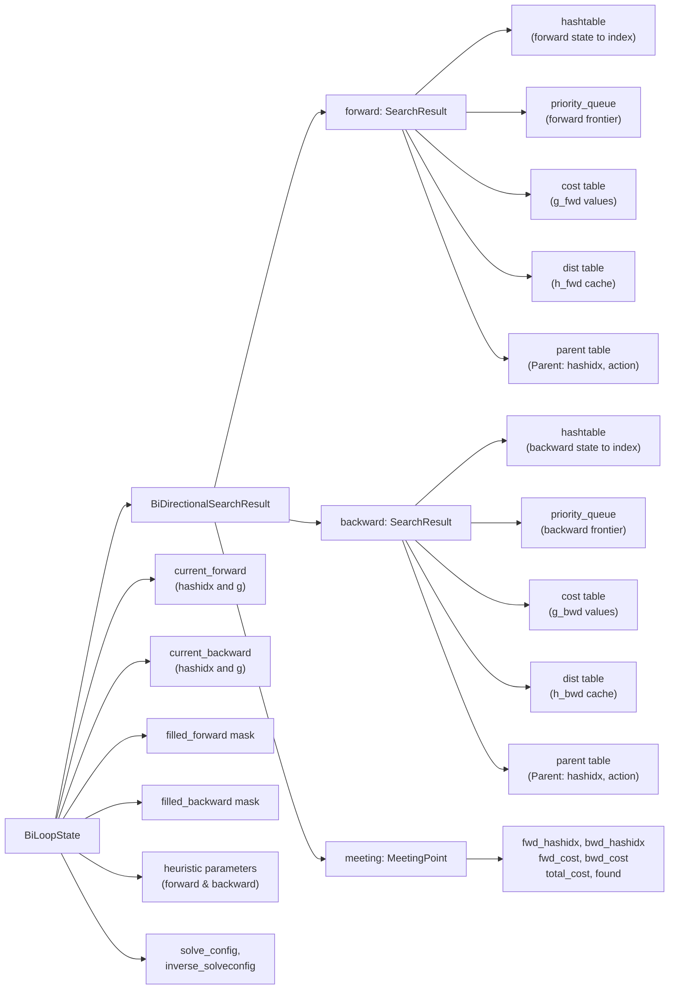
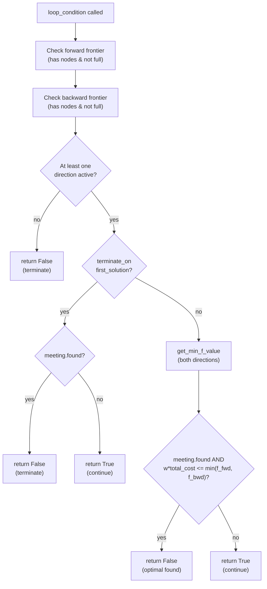
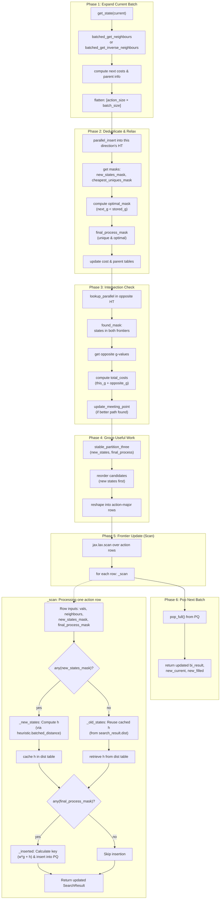
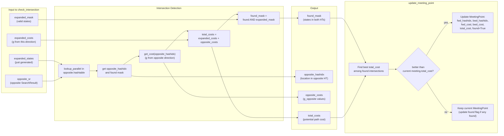
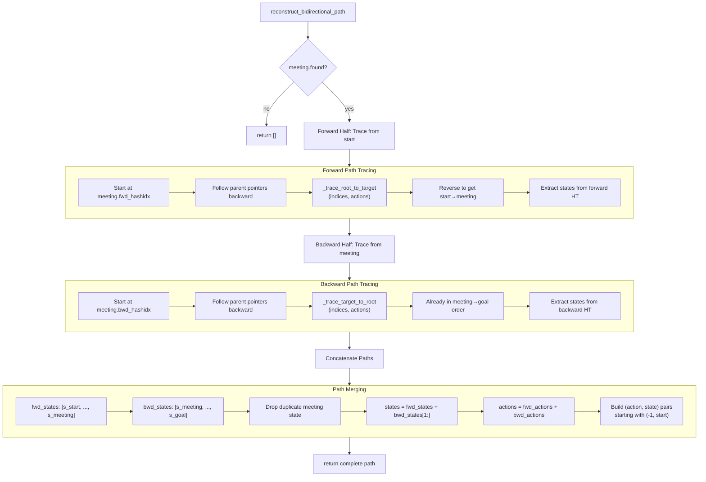

# Bidirectional A\* Command (`bi_astar`)

The `bi_astar` command solves a puzzle using the Bidirectional A\* search algorithm. This algorithm runs two simultaneous A\* searches: one forward from the initial state and one backward from the goal state. It stops when the two searches meet, often significantly reducing the number of nodes explored compared to standard A\*.

## Usage

The basic syntax for the `bi_astar` command is:

```bash
python main.py bi_astar [OPTIONS]
```

Example:

```bash
python main.py bi_astar -p rubikscube -nn
```

## Options

The `bi_astar` command uses similar option groups to the standard `astar` command.

### Puzzle Options (`@puzzle_options`)

These options define the puzzle environment to be solved.

-   `-p, --puzzle`: Specifies the puzzle to solve.
    -   Type: `Choice`
    -   Default: `n-puzzle`
-   `-pargs, --puzzle_args`: JSON string for additional puzzle-specific arguments.
    -   Type: `String`
-   `-h, --hard`: If available, use a "hard" version of the puzzle.
    -   Type: `Flag`
-   `-s, --seeds`: A comma-separated list of seeds for generating initial puzzle states.
    -   Type: `String`
    -   Default: `"0"`

### Search Options (`@search_options`)

These options control the behavior of the search algorithm.

-   `-m, --max_node_size`: The maximum number of nodes to explore.
    -   Type: `String`
-   `-b, --batch_size`: The number of nodes to process in a single batch.
    -   Type: `Integer`
-   `-w, --cost_weight`: The weight `w` for the path cost.
    -   Type: `Float`
-   `-pr, --pop_ratio`: Ratio for popping nodes from the priority queue.
    -   Type: `Float`
-   `-vm, --vmap_size`: The number of different initial states to solve in parallel.
    -   Type: `Integer`
-   `--debug`: Disables JIT compilation.
    -   Type: `Flag`
-   `--profile`: Enables profiler.
    -   Type: `Flag`
-   `--show_compile_time`: Prints compilation time.
    -   Type: `Flag`

### Heuristic Options (`@heuristic_options`)

-   `-nn, --neural_heuristic`: Use a pre-trained neural network as the heuristic function.
    -   Type: `Flag`
-   `--param-path`: Path to the heuristic parameter file.
    -   Type: `String`
-   `--model-type`: Type of the heuristic model.
    -   Type: `String`

### Visualization Options (`@visualize_options`)

-   `-vt, --visualize_terminal`: Renders the solution path in the terminal.
    -   Type: `Flag`
-   `-vi, --visualize_imgs`: Generates images and GIF for the solution.
    -   Type: `Flag`
-   `-mt, --max_animation_time`: Max duration for GIF.
    -   Type: `Integer`

---

## Implementation Notes (JAxtar/bi_stars/bi_astar.py)

Bidirectional A* search explores the state space from both directions simultaneously, aiming to meet at a common state. This strategy typically reduces the number of explored nodes from $O(b^d)$ to $O(b^{d/2})$.

The implementation is built around two parallel SearchResult instances (forward and backward), each with their own hashtable and priority queue. The core loop is constructed by `_bi_astar_loop_builder(...)` and executed by `jax.lax.while_loop`.

### High-Level Control Flow



### Data Structures At A Glance



### Dual-Frontier Search Structure

The algorithm maintains two independent search trees:
1. **Forward Search**: Starts from the `initial_state` and searches toward the goal using `solve_config`
2. **Backward Search**: Starts from the `goal_state` and searches toward the initial state using `inverse_solveconfig` (created via `puzzle.hindsight_transform`)

Both directions use the same core expansion logic but with direction-specific configurations:
- Forward: `puzzle.batched_get_neighbours`
- Backward: `puzzle.batched_get_inverse_neighbours`

### Loop Condition (common_bi_loop_condition)

The search continues while:
1. **Has Work**: At least one direction has nodes to expand AND hashtable capacity
   - `(fwd_has_nodes AND fwd_not_full) OR (bwd_has_nodes AND bwd_not_full)`
2. **Not Terminated**: Based on termination mode:
   - `terminate_on_first_solution=True` (default): Continue until any meeting point found
   - `terminate_on_first_solution=False`: Continue until optimality proven via f-value bounds



### Loop Body Data Flow (One Iteration)

Each iteration expands batches from both directions (if available), checks for intersections with the opposite frontier, and updates the meeting point if a better path is found.

```mermaid
flowchart TD
  subgraph LoopBody["loop_body (one iteration)"]
    L1["Check forward capacity"] --> L2{"fwd_has_nodes<br/>AND fwd_not_full?"}
    L2 -- yes --> L3["_expand_direction(forward)"]
    L2 -- no --> L4["skip forward expansion"]

    L3 --> L5["Check backward capacity"]
    L4 --> L5

    L5 --> L6{"bwd_has_nodes<br/>AND bwd_not_full?"}
    L6 -- yes --> L7["_expand_direction(backward)"]
    L6 -- no --> L8["skip backward expansion"]

    L7 --> L9["create new BiLoopState"]
    L8 --> L9
    L9 --> L10["return updated loop state"]
  end

  subgraph ExpandDir["_expand_direction (per direction)"]
    direction expand_detail
      E1["Phase 1: Expand"] --> E2["Phase 2: Deduplicate & Relax"]
      E2 --> E3["Phase 3: Intersection Check"]
      E3 --> E4["Phase 4: Group Useful Work"]
      E4 --> E5["Phase 5: Frontier Update"]
      E5 --> E6["Phase 6: Pop Next Batch"]
  end

  L3 -.-> expand_detail
  L7 -.-> expand_detail
```

### Detailed Loop Body Data Flow (_expand_direction)

The expansion of one direction follows a 6-phase pipeline similar to unidirectional A*, with an added intersection check phase.



### Intersection Detection Mechanism

The intersection check is the key differentiator from unidirectional A*. After expanding states in one direction, we immediately check if those states exist in the opposite direction's hashtable.



### Path Reconstruction (reconstruct_bidirectional_path)

Unlike unidirectional A*, bidirectional search reconstructs the path by tracing from the meeting point in both directions, then concatenating the paths.



### Key Implementation Details

From `JAxtar/bi_stars/bi_astar.py` and `JAxtar/bi_stars/bi_search_base.py`:

- **Hindsight Transformation**: `inverse_solveconfig = puzzle.hindsight_transform(solve_config, start)` transforms the backward search configuration so it treats the start state as its target
- **Intersection Check Timing**: Performed after every expansion using all valid neighbors (`flatten_filleds`), not just newly inserted states, to catch states added to the opposite frontier in the current iteration
- **Meeting Point Update**: Uses stored g-values from hashtables (`this_costs = search_result.get_cost(hash_idx)`), not candidate costs, to ensure correctness with duplicate discoveries
- **Backward Heuristic**: Can be disabled for fixed heuristics (`use_backward_heuristic = not heuristic.is_fixed`) to save computation
- **Termination Modes**:
  - `terminate_on_first_solution=True` (default): Fast termination, may not guarantee optimality
  - `terminate_on_first_solution=False`: Continues until `w * total_cost <= min(f_fwd, f_bwd)` for optimality proof
- **Path Reconstruction Convention**: Backward search stores forward actions in parent table (puxle convention), so no action inversion needed during reconstruction

### Optimality Considerations

To ensure an optimal path with `terminate_on_first_solution=False`:
1. Heuristic must be admissible in both directions
2. `cost_weight` should be 1.0 or very close to it (default: `1.0 - 1e-6`)
3. Search continues until the weighted meeting cost is proven optimal via f-value bounds:
   - `w * meeting.total_cost <= f_fwd_min` (all unexpanded forward states have higher f)
   - `w * meeting.total_cost <= f_bwd_min` (all unexpanded backward states have higher f)
