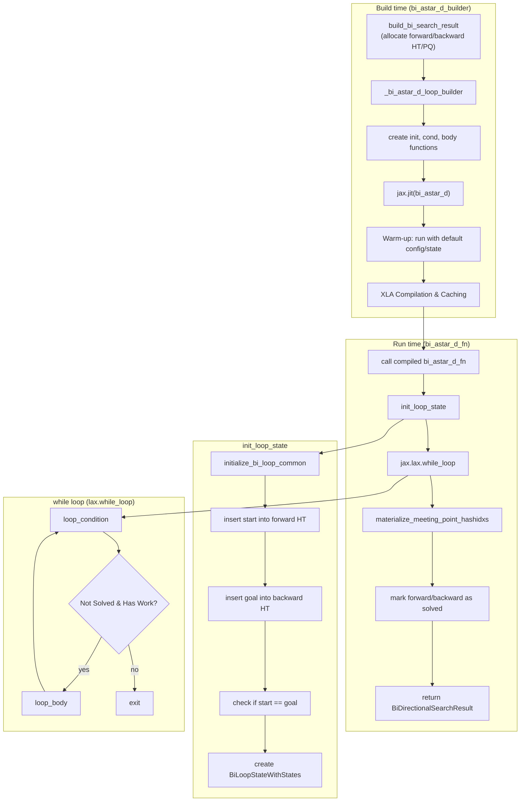
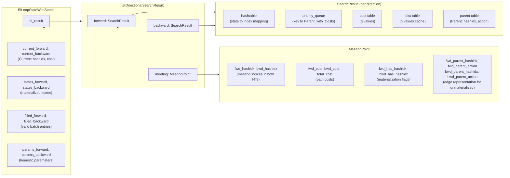
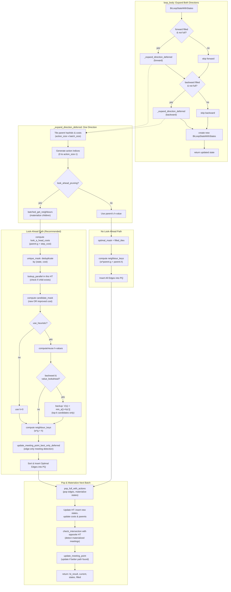
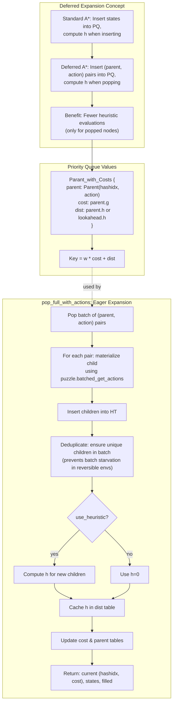
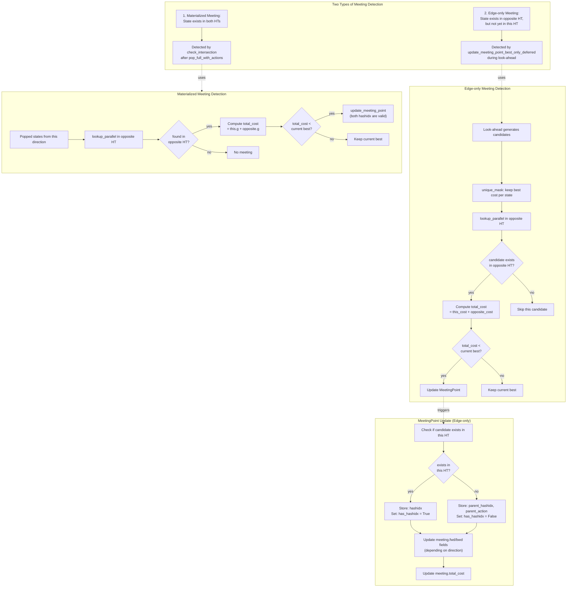
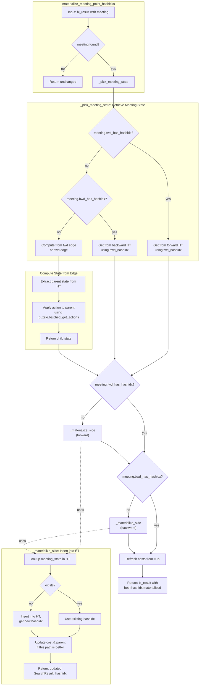
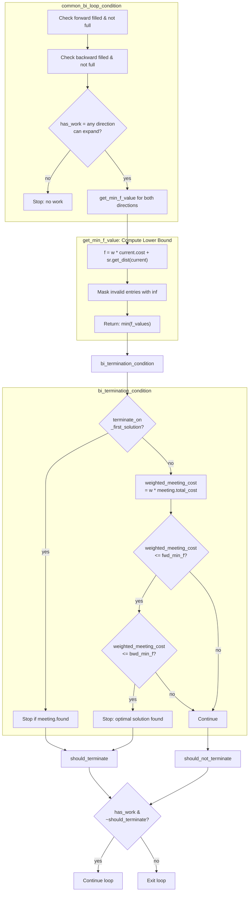

# Bidirectional A\* Deferred Command (`bi_astar_d`)

The `bi_astar_d` command solves a puzzle using the Bidirectional A\* Deferred search algorithm. This combines bidirectional search (forward and backward) with deferred node expansion. It is useful for reducing the search space in complex problems where node expansion is costly.

## Usage

The basic syntax for the `bi_astar_d` command is:

```bash
python main.py bi_astar_d [OPTIONS]
```

Example:

```bash
python main.py bi_astar_d -p rubikscube -nn
```

## Options

The `bi_astar_d` command uses the same option groups as `bi_astar`.

### Puzzle Options (`@puzzle_options`)

-   `-p, --puzzle`: Specifies the puzzle to solve.
-   `-pargs, --puzzle_args`: JSON string for additional puzzle arguments.
-   `-h, --hard`: Use a hard version of the puzzle.
-   `-s, --seeds`: Comma-separated list of seeds.

### Search Options (`@search_options`)

-   `-m, --max_node_size`: Max nodes to explore.
-   `-b, --batch_size`: Batch size for GPU processing.
-   `-w, --cost_weight`: Path cost weight.
-   `-pr, --pop_ratio`: Pop ratio.
-   `-vm, --vmap_size`: Parallel solve size via vmap.
-   `--debug`: Disable JIT.
-   `--profile`: Enable profiling.
-   `--show_compile_time`: Print compile time.

### Heuristic Options (`@heuristic_options`)

-   `-nn, --neural_heuristic`: Use neural network heuristic.
-   `--param-path`: Path to heuristic parameters.
-   `--model-type`: Heuristic model type.

### Visualization Options (`@visualize_options`)

-   `-vt, --visualize_terminal`: Render path in terminal.
-   `-vi, --visualize_imgs`: Generate images/GIF.
-   `-mt, --max_animation_time`: Max GIF duration.

---

## Implementation Notes (JAxtar/bi_stars/bi_astar_d.py)

Bidirectional A* Deferred (`bi_astar_d`) is an advanced search algorithm that combines the search space reduction of bidirectional search with the computational efficiency of deferred expansion. This implementation is fully JIT-compiled with JAX for high performance on accelerators.

### Key Strategy: Deferred Meeting Detection

Unlike standard bidirectional search, `bi_astar_d` stores actions (edges) in the priority queue rather than fully materialized states. States are only generated when a node is popped from the priority queue.

1. **Pop & Materialize**: Both forward and backward directions pop node batches using `pop_full_with_actions`, which materializes child states from (parent, action) pairs during the pop operation.
2. **Intersection Check**: After materializing states during the pop step, each direction checks if the new states exist in the opposite direction's hash table using `check_intersection`.
3. **Edge-only Meeting**: With `look_ahead_pruning=True`, meeting points can be detected early by looking ahead at neighbors. If a meeting is found via an edge not yet in the hash table, it's recorded as (parent_hashidx, action) for later materialization.

The core loop is built by `_bi_astar_d_loop_builder(...)` and executed by `jax.lax.while_loop`.

### High-Level Control Flow



### Data Structures At A Glance



### Loop Body Data Flow (One Iteration)

The loop body expands both forward and backward directions in sequence. Each direction:
1. Pops the current batch and generates candidate edges (parent, action) pairs
2. Materializes child states for look-ahead
3. Performs deduplication and cost-based filtering
4. Detects meeting points (both materialized and edge-only)
5. Inserts optimal edges into the priority queue
6. Pops and materializes the next batch for the next iteration

Key implementation details from `JAxtar/bi_stars/bi_astar_d.py`:

- **Deferred Expansion**: `_expand_direction_deferred` generates (parent, action) pairs and inserts them into the PQ with keys based on parent's f-value
- **Look-ahead Pruning**: When enabled, neighbors are materialized early for cost-based filtering and early meeting detection
- **Backward Value Lookahead**: Optional optimization for backward direction that uses 1-step Q-value backup (V(s) = min_a [1 + h(s')]) to improve pruning
- **Edge-only Meeting Detection**: `update_meeting_point_best_only_deferred` can record meeting points without inserting into hash table
- **Eager Pop Expansion**: `pop_full_with_actions` performs state materialization during pop to ensure unique states in the batch



### Deferred Expansion Details



### Deferred Meeting Detection Mechanism



### materialize_meeting_point_hashidxs Flow

After the search loop terminates, the meeting point may be represented via an edge (parent_hashidx, action) on one or both sides. This function ensures that the meeting state has valid hashidx entries in both hash tables for path reconstruction.



### Loop Condition & Termination



### Mandatory Optimization: look_ahead_pruning

In `bi_astar_d`, `look_ahead_pruning` is **forced to True**. This is critical because:

1. **Accurate f-values**: Without look-ahead, the PQ key uses the parent's f-value, which doesn't reflect the true cost of the child. This breaks the termination condition.
2. **Edge-only Meeting Detection**: Look-ahead enables early meeting detection without inserting into the hash table, reducing total expansions.
3. **Better Pruning**: Filtering candidates before PQ insertion prevents unnecessary work.

The builder function enforces this with a warning if `look_ahead_pruning=False` is passed.
