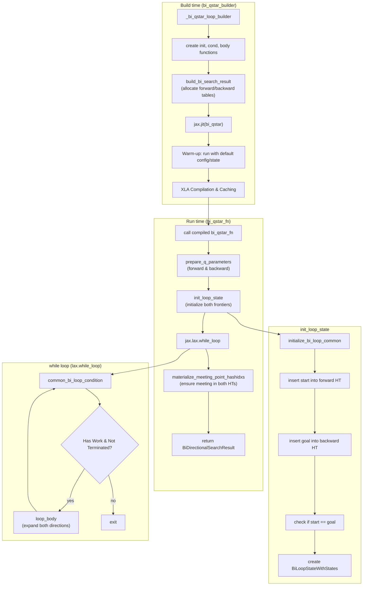
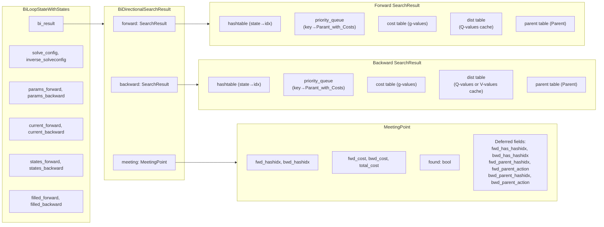
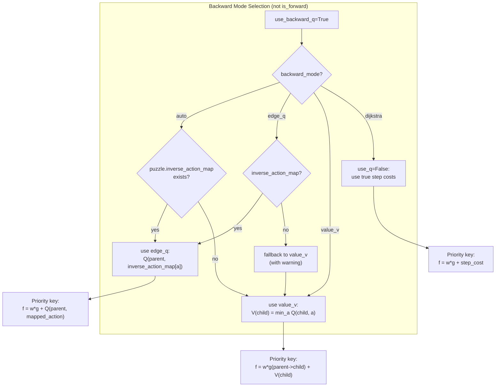
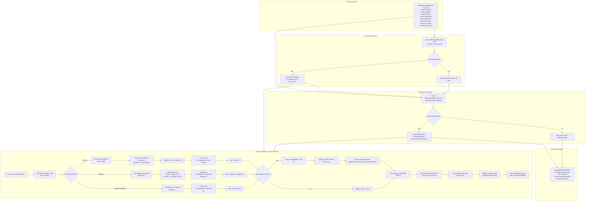
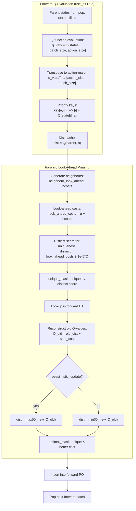
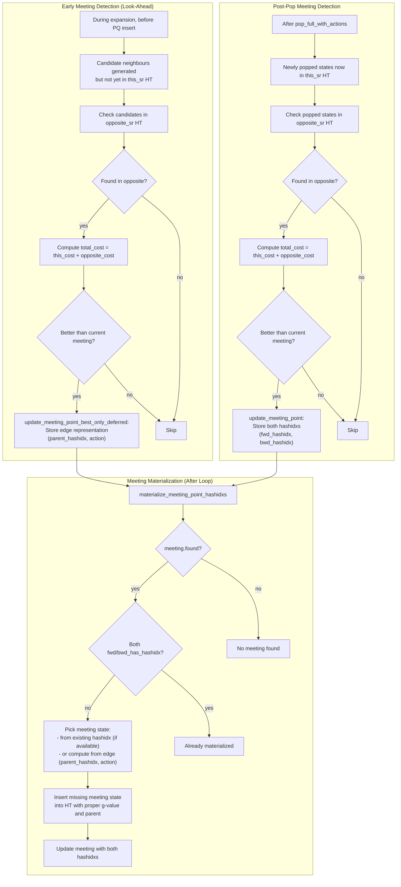
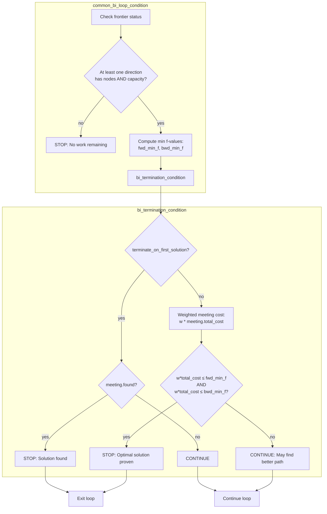

# Bidirectional Q\* Command (`bi_qstar`)

The `bi_qstar` command solves a puzzle using the Bidirectional Q\* search algorithm. It performs bidirectional search using Q-values to guide the expansion in both forward and backward directions. This allows for more informed search steps compared to standard heuristic-based search.

## Usage

The basic syntax for the `bi_qstar` command is:

```bash
python main.py bi_qstar [OPTIONS]
```

Example:

```bash
python main.py bi_qstar -p rubikscube -nn
```

## Options

The `bi_qstar` command uses similar option groups to the `qstar` command.

### Puzzle Options (`@puzzle_options`)

-   `-p, --puzzle`: Specifies the puzzle to solve.
-   `-pargs, --puzzle_args`: JSON string for additional puzzle arguments.
-   `-h, --hard`: Use a hard version of the puzzle.
-   `-s, --seeds`: Comma-separated list of seeds.

### Search Options (`@search_options`)

-   `-m, --max_node_size`: Max nodes to explore.
-   `-b, --batch_size`: Batch size.
-   `-w, --cost_weight`: Path cost weight.
-   `-pr, --pop_ratio`: Pop ratio.
-   `-vm, --vmap_size`: Parallel solve size via vmap.
-   `--debug`: Disable JIT.
-   `--profile`: Enable profiling.
-   `--show_compile_time`: Print compile time.

### Q-Function Options (`@qfunction_options`)

-   `-nn, --neural_qfunction`: Use neural network Q-function.
-   `--param-path`: Path to Q-function parameters.
-   `--model-type`: Q-function model type.

### Visualization Options (`@visualize_options`)

-   `-vt, --visualize_terminal`: Render path in terminal.
-   `-vi, --visualize_imgs`: Generate images/GIF.
-   `-mt, --max_animation_time`: Max GIF duration.

---

## Implementation Notes (JAxtar/bi_stars/bi_qstar.py)

Bidirectional Q* (`bi_qstar`) applies the action-value guidance of $Q(s, a)$ to both forward and backward searches. This algorithm is highly specialized for environments where a Q-function has been trained for both forward and inverse dynamics.

The implementation is built around two `SearchResult` instances (forward/backward) wrapped in a `BiDirectionalSearchResult`, each with its own hashtable and priority queue. The core loop is executed by `jax.lax.while_loop` with alternating expansions from both directions.

### High-Level Control Flow



### Data Structures for Bidirectional Q*



### Backward Direction Scoring Modes

Scoring a backward transition $(s_{next} \to s_{prev})$ using a forward-oriented Q-function is non-trivial. JAxtar provides several `backward_mode` options:

| Mode | Description | Requirements |
| :--- | :--- | :--- |
| **`edge_q`** | Uses $Q(s, a)$ of the *forward equivalent* edge. | `inverse_action_map` |
| **`value_v`** | Uses $V(s) = \min_a Q(s, a)$ as a node heuristic. | None (Auto-fallback) |
| **`dijkstra`** | Ignores Q-values in the backward direction. | None |
| **`auto`** | Uses `edge_q` if possible, otherwise `value_v`. | Recommended |



### Inverse Action Mapping (edge_q mode)

The `edge_q` mode requires `puzzle.inverse_action_map` to translate backward action indices to their forward equivalents, enabling Q-value reuse:

```mermaid
flowchart LR
  subgraph Forward["Forward Direction"]
    FS["Parent State s"] --> FA["Action a<br/>(forward)"]
    FA --> FCHILD["Child State s'"]
    FQ["Q(s, a)"] -.-> FA
  end

  subgraph Backward["Backward Direction (edge_q)"]
    BCHILD["Parent State s'<br/>(was child)"] --> BINV["Inverse Neighbour [i]<br/>(returns s)"]
    BINV --> BS["Child State s<br/>(was parent)"]
    BMAP["inverse_action_map[i] → a"] -.-> BINV
    BQ["Q(s', inverse_action_map[i])<br/>≠ Q(s, a)<br/>(wrong direction!)"] -.x BINV
    CORRECT["Use Q(s, a) via mapping:<br/>Q(parent_s, mapped_action)"] -.-> BINV
  end

  subgraph Mapping["inverse_action_map"]
    MAP["For each inverse action i:<br/>map[i] = forward action<br/>that produces inverse[i]"]
  end

  BMAP --> MAP

  style FQ fill:#90EE90
  style BQ fill:#FFB6C1
  style CORRECT fill:#87CEEB
```

### Loop Body Data Flow (One Iteration)

The loop body performs expansions in both directions, using Q-functions to score edges and detect intersections between frontiers.



### Detailed Forward Direction Q-Evaluation



### Detailed Backward Direction Q-Evaluation (edge_q vs value_v)

```mermaid
flowchart TD
  subgraph BwdEdgeQ["Backward edge_q Mode"]
    EQ1["Parent states (backward direction):<br/>states, filled"] --> EQ2["Q-function evaluation:<br/>q_vals = Q(states, :)<br/>[batch_size, action_size]"]
    EQ2 --> EQ3["Remap via inverse_action_map:<br/>q_vals = q_vals[inv_map, :]"]
    EQ3 --> EQ4["Transpose to action-major:<br/>q_vals.T → [action_size, batch_size]"]
    EQ4 --> EQ5["Priority keys:<br/>key[a,i] = w*g[i] + Q_remapped(state[i], a)"]
    EQ5 --> EQ6["Dist cache:<br/>dist = Q_remapped(parent, a)"]
    EQ6 --> EQ7["Continue with look-ahead pruning<br/>(same as forward)"]
  end

  subgraph BwdValueV["Backward value_v Mode"]
    VV1["Parent states (backward direction):<br/>states, filled"] --> VV2["Generate inverse neighbours:<br/>neighbour_look_ahead, ncosts<br/>[action_size, batch_size]"]
    VV2 --> VV3["Flatten to candidates:<br/>[action_size * batch_size]"]
    VV3 --> VV4["Packed reordering:<br/>stable_partition_three<br/>(valid entries first)"]
    VV4 --> VV5["Reshape to chunks:<br/>[action_size, batch_size]"]
    VV5 --> VV6["Chunked Q-evaluation via scan:<br/>for each chunk:<br/>  Q(chunk_states, :) → [b, a]<br/>  V = min_a Q(chunk, a)"]
    VV6 --> VV7["Reverse permutation:<br/>restore original order"]
    VV7 --> VV8["V-values for all candidates:<br/>V(child) for each neighbour"]
    VV8 --> VV9["Priority keys:<br/>key = w*(g + step_cost) + V(child)"]
    VV9 --> VV10["Dist cache:<br/>dist = V(child)"]
    VV10 --> VV11["Relaxed meeting mask:<br/>unique by cost only"]
    VV11 --> VV12["Look-ahead pruning:<br/>optimal_mask & meeting detection"]
  end

  subgraph BwdDijkstra["Backward dijkstra Mode (use_q=False)"]
    DJ1["use_q=False"] --> DJ2["Generate neighbours:<br/>neighbour_look_ahead, ncosts"]
    DJ2 --> DJ3["Use step costs as 'Q-values':<br/>q_vals = ncosts"]
    DJ3 --> DJ4["Priority keys:<br/>key = w*g + step_cost"]
    DJ4 --> DJ5["Dist cache:<br/>dist = 0 (step_cost - step_cost)"]
    DJ5 --> DJ6["Continue with standard logic"]
  end
```



### Meeting Point Detection and Materialization

Bidirectional Q* uses two mechanisms for detecting meeting points:



### Loop Condition and Termination



### Key Optimizations

#### 1. Packed Value-Heuristic (`value_v`)
When using `value_v` mode, computing $V(s) = \min_a Q(s, a)$ for every child state in a batch can be expensive. JAxtar uses a **packed+chunked** approach:
- Child states are filtered and packed contiguously using `stable_partition_three`.
- Q-evaluations are processed in smaller chunks to avoid memory spikes.
- $V(s)$ is extracted as the minimum across the action dimension of the Q-output.

#### 2. Inverse Action Support (`edge_q`)
If the puzzle defines an `inverse_action_map`, the backward search can interpret an inverse action ID as its corresponding forward action. This allows it to use the exact $Q(s, a)$ training for the edge, making the backward search as "smart" as the forward one.

#### 3. Deferred Meeting Detection
Like other bidirectional deferred variants, `bi_qstar` can detect meeting points during look-ahead without inserting states into the hash table. The meeting point stores edge information `(parent_hashidx, action)` for deferred states, which are materialized via `materialize_meeting_point_hashidxs` after the loop completes.

#### 4. Pessimistic vs Optimistic Updates
When a state is revisited via multiple edges, Q* must decide how to combine Q-values:
- **Pessimistic** (`pessimistic_update=True`): Use `max(Q_new, Q_old)` — conservative, prevents over-optimism
- **Optimistic** (`pessimistic_update=False`): Use `min(Q_new, Q_old)` — aggressive, may find better paths faster

The reconstructed Q-value for comparison is: $Q_{old} = dist_{stored} + step\_cost$
