# Iterative Deepening A\* Command (`id_astar`)

The `id_astar` command solves a puzzle using the Iterative Deepening A\* (IDA\*) search algorithm. IDA\* combines the space efficiency of depth-first search with the optimality of A\*. It performs a series of depth-first searches with increasing cost thresholds.

## Usage

The basic syntax for the `id_astar` command is:

```bash
python main.py id_astar [OPTIONS]
```

Example:

```bash
python main.py id_astar -p rubikscube -nn
```

## Options

The `id_astar` command uses the same option groups as `astar`.

### Puzzle Options (`@puzzle_options`)

-   `-p, --puzzle`: Specifies the puzzle to solve.
-   `-pargs, --puzzle_args`: JSON string for additional puzzle arguments.
-   `-h, --hard`: Use a hard version of the puzzle.
-   `-s, --seeds`: Comma-separated list of seeds.

### Search Options (`@search_options`)

-   `-m, --max_node_size`: Max nodes to explore (per iteration).
-   `-b, --batch_size`: Batch size for GPU processing.
-   `-w, --cost_weight`: Path cost weight.
-   `-pr, --pop_ratio`: Pop ratio.
-   `-vm, --vmap_size`: Parallel solve size via vmap.
-   `--debug`: Disable JIT.
-   `--profile`: Enable profiling.
-   `--show_compile_time`: Print compile time.

### Heuristic Options (`@heuristic_options`)

-   `-nn, --neural_heuristic`: Use neural network heuristic.
-   `--param-path`: Path to heuristic parameters.
-   `--model-type`: Heuristic model type.

### Visualization Options (`@visualize_options`)

-   `-vt, --visualize_terminal`: Render path in terminal.
-   `-vi, --visualize_imgs`: Generate images/GIF.
-   `-mt, --max_animation_time`: Max GIF duration.

---

## Implementation Notes (JAxtar/id_stars/id_astar.py)

This section documents the actual control flow and data flow in `JAxtar/id_stars/id_astar.py`.

Iterative Deepening A* (IDA*) is an optimal search algorithm that performs a sequence of depth-first searches with increasing cost thresholds (bounds). JAxtar implements a **Batched IDA*** that leverages JAX to parallelize the depth-first exploration while maintaining memory efficiency.

The core distinction from standard A* is the dual-loop structure:
- Standard A* uses a priority queue with one while loop
- IDA* uses a stack with two nested while loops (outer for bound management, inner for DFS)

### High-Level Control Flow

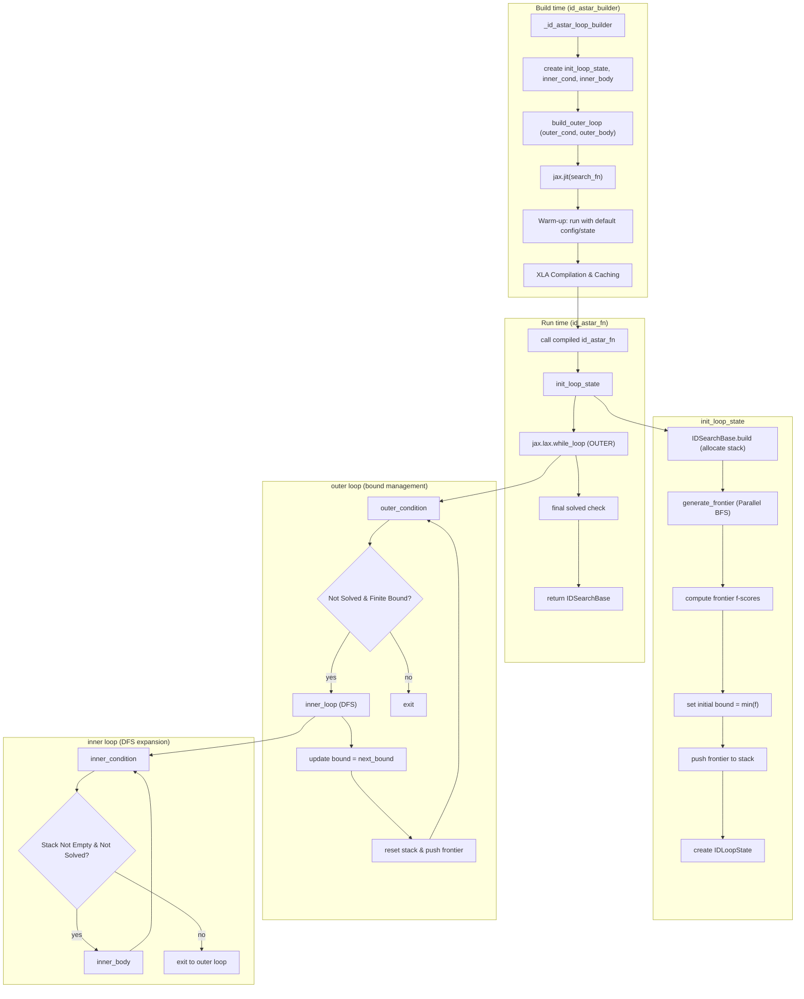

### Data Structures At A Glance

The IDA* implementation uses a fundamentally different data structure architecture compared to A*:

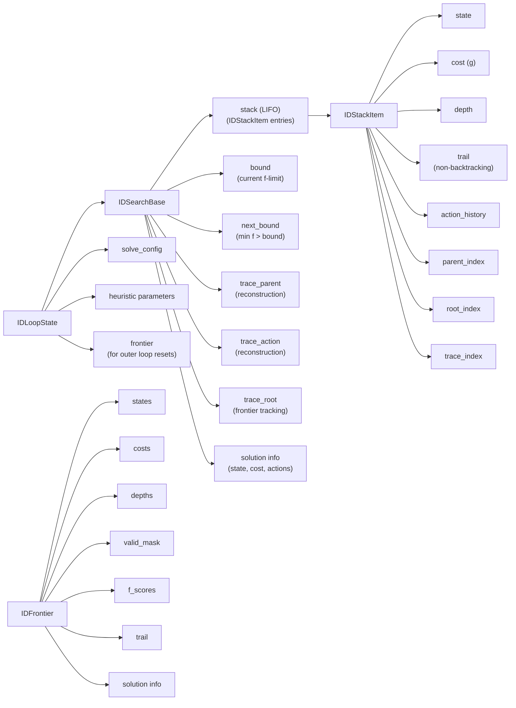

#### Key Differences from A*

**A* (SearchResult)**:
- hashtable: Maps states to indices for O(1) deduplication across all iterations
- priority_queue: Orders frontier by f-score
- cost/dist/parent tables: Indexed by hashtable indices

**IDA* (IDSearchBase)**:
- stack: LIFO structure for DFS ordering (no hashtable needed per iteration)
- bound/next_bound: Cost thresholds for pruning
- trace arrays: Parent/action tracking for path reconstruction
- In-batch deduplication only (no global state tracking)

### Data Structure Details

#### `IDFrontier`

A specialized container for the initial frontier generation and outer loop resets.

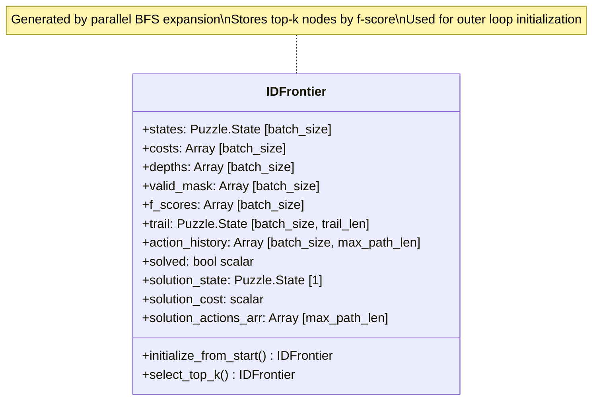

**Purpose**: The frontier is computed once at the start via batched BFS (`generate_frontier`), then cached in `IDLoopState.frontier`. On each outer loop iteration, the frontier is filtered by the new bound and pushed back onto the stack.

**Trail mechanism**: Each state maintains a fixed-length history of recent parent states. This prevents immediate backtracking without needing a global hashtable.

#### `IDNodeBatch`

A batched representation of candidate nodes during expansion.

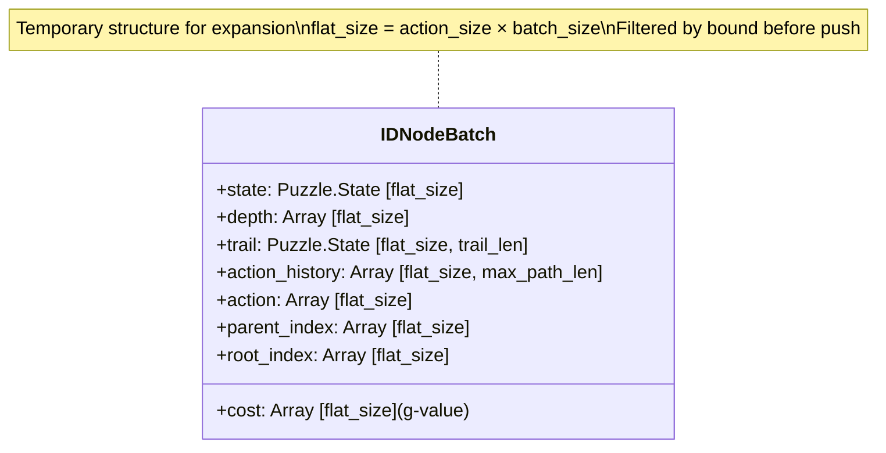

**Layout**: Generated by flattening `(action_size, batch_size)` shaped neighbour arrays into `(flat_size,)` for vectorized processing.

#### `IDStackItem`

The actual data stored in the stack.

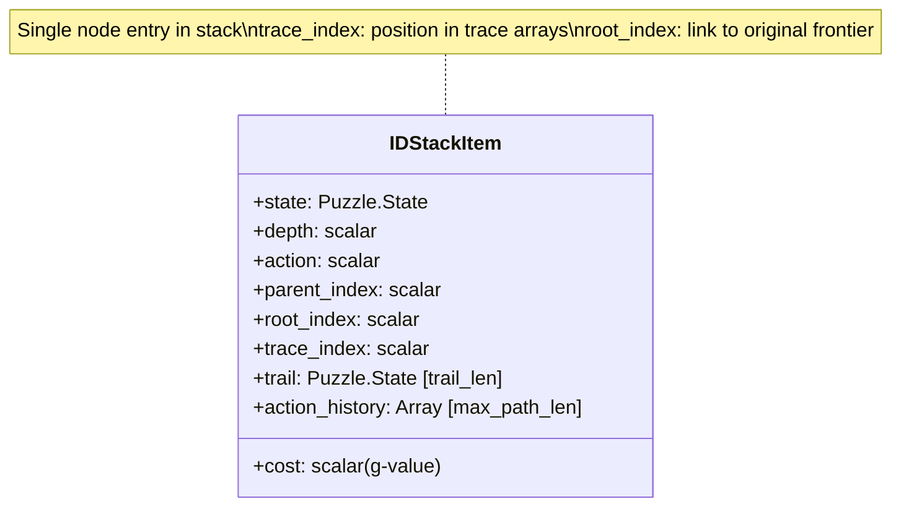

**Trace system**: `trace_index` maps to positions in `trace_parent`, `trace_action`, `trace_root` arrays. This allows efficient path reconstruction when a solution is found.

### Dual-Loop Structure (Detailed)

IDA* uses two nested `jax.lax.while_loop` calls to achieve iterative deepening while remaining JIT-compatible.

#### Outer Loop: Bound Management

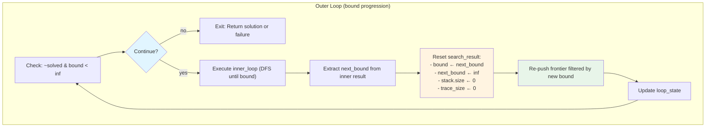

**Key insight**: The outer loop doesn't expand nodes itself. It manages the bound threshold and resets the stack for each iteration. The frontier (computed once at init) is re-used across iterations.

#### Inner Loop: Parallel DFS Expansion

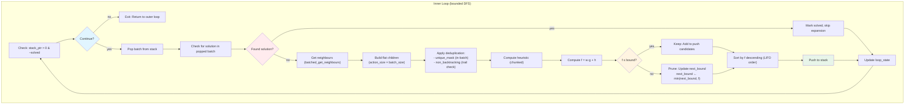

**Stack ordering**: Nodes are sorted by f-score in descending order before push. This means the stack operates as a LIFO structure where `pop()` retrieves the lowest f-score nodes first (best-first DFS).

### Loop Body Data Flow (Inner Loop Iteration)

The inner loop body performs one parallel DFS step: pop a batch, expand, prune by bound, and push back.

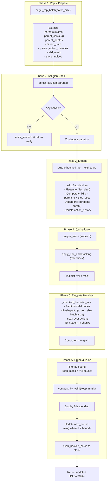

### Bound Progression & Pruning

The key to IDA* optimality is how the bound increases across iterations.

```mermaid
flowchart LR
  subgraph Init["Initialization"]
    I1["Generate frontier (BFS)"] --> I2["Compute frontier f-scores"]
    I2 --> I3["bound ← min(f)"]
    I3 --> I4["next_bound ← inf"]
  end

  subgraph Iter1["Iteration 1 (bound = b₁)"]
    IT1_1["Inner loop expands nodes"] --> IT1_2{"Process node with f"}
    IT1_2 -- "f ≤ b₁" --> IT1_3["Push to stack"]
    IT1_2 -- "f > b₁" --> IT1_4["next_bound ← min(next_bound, f)"]
    IT1_3 --> IT1_5["Continue until stack empty"]
    IT1_4 --> IT1_5
    IT1_5 --> IT1_6["Outer loop: bound ← next_bound = b₂"]
  end

  subgraph Iter2["Iteration 2 (bound = b₂)"]
    IT2_1["Reset stack, re-push frontier"] --> IT2_2["Inner loop with new bound"]
    IT2_2 --> IT2_3["Process nodes: f ≤ b₂ allowed"]
    IT2_3 --> IT2_4["Update next_bound = b₃"]
  end

  subgraph IterN["Iteration N (bound = bₙ)"]
    ITN_1["..."] --> ITN_2["Eventually f_solution ≤ bound"]
    ITN_2 --> ITN_3["Solution found: Exit"]
  end

  I4 --> IT1_1
  IT1_6 --> IT2_1
  IT2_4 --> ITN_1

  style I3 fill:#e8f5e9
  style IT1_6 fill:#fff4e1
  style ITN_3 fill:#e1f5ff
```

**Bound sequence**: b₁ ≤ b₂ ≤ b₃ ≤ ... ≤ f*(solution)

Each bound is the minimum f-value that was pruned in the previous iteration. This ensures no better solution exists below each threshold.

### Optimality Guarantee

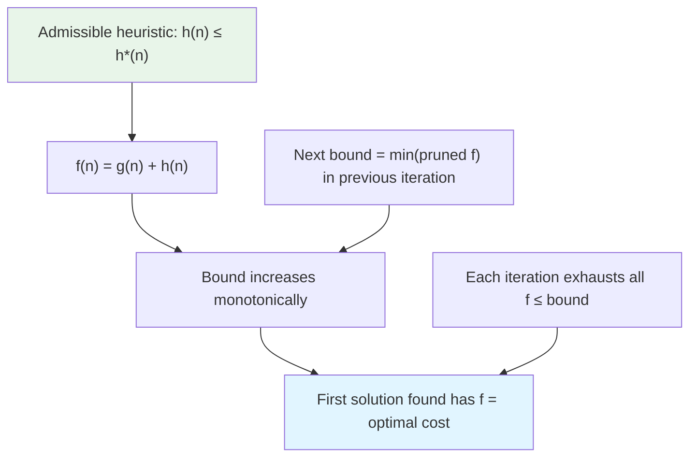

IDA* maintains optimality because:
1. The bound increases in discrete steps (minimum pruned f-values)
2. Each iteration completely explores all nodes with f ≤ bound
3. The first solution found must have the optimal cost (no better f exists below that bound)

### Parallel DFS Implementation

Unlike traditional recursive IDA*, JAxtar uses batched parallel processing:

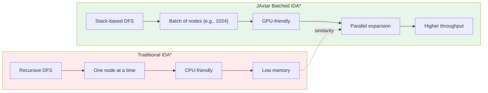

**Batch size**: The `batch_size` parameter controls how many nodes are popped and expanded in parallel. Larger batches improve GPU utilization but may do redundant work if a solution is found mid-batch.

### Memory Efficiency

IDA* is memory-efficient compared to A*:

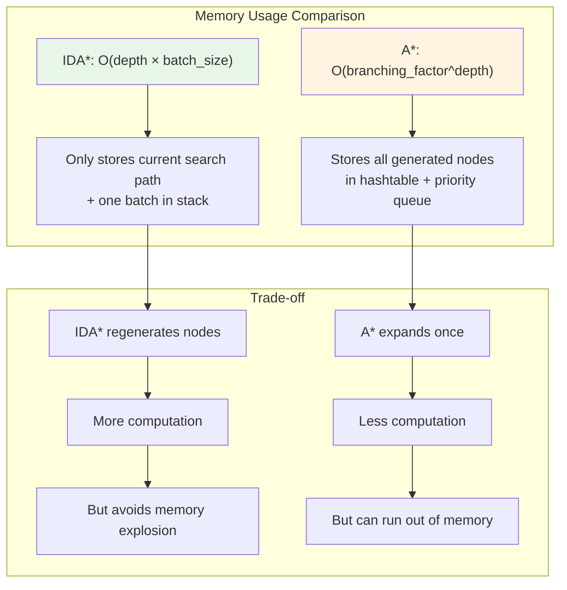

**Stack capacity**: The `max_nodes` parameter limits the stack size. If exceeded, the search may fail to find a solution (though this is rare with appropriate settings).

### Non-Backtracking Optimization

The trail mechanism prevents immediate backtracking:

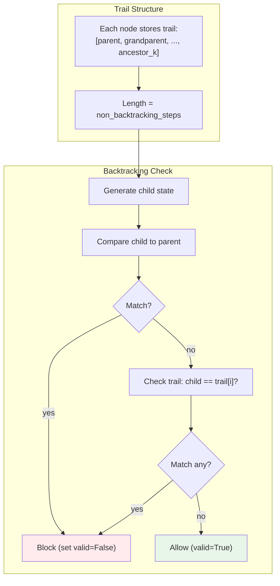

**Parameter tuning**: `non_backtracking_steps=0` disables trail checking (faster but may explore redundant paths). Values of 1-3 typically provide good balance.

### JIT Compilation Strategy

The compilation process mirrors A* but must handle the nested loop structure:

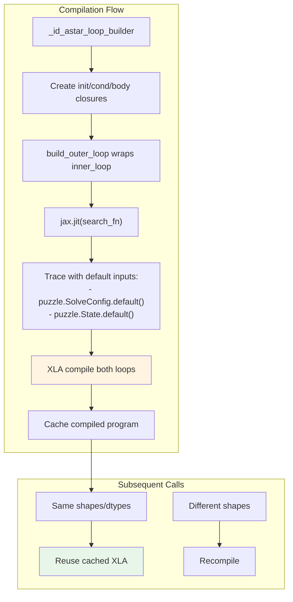

**Compilation time**: IDA* typically compiles faster than A* because there's no hashtable tracing. However, the nested loop structure adds some complexity.

### Chunked Heuristic Evaluation

To avoid memory issues with large flat batches, the heuristic is evaluated in action-sized chunks:

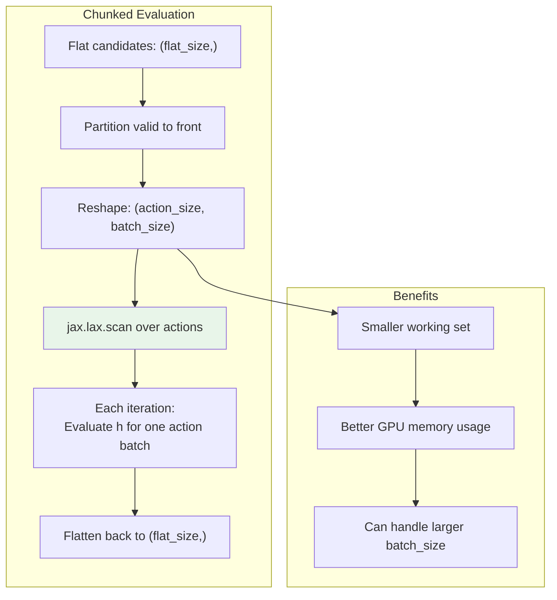

**Why chunking?** Evaluating `flat_size = action_size × batch_size` states at once can exceed GPU memory. Chunking processes `batch_size` states at a time via scan.
