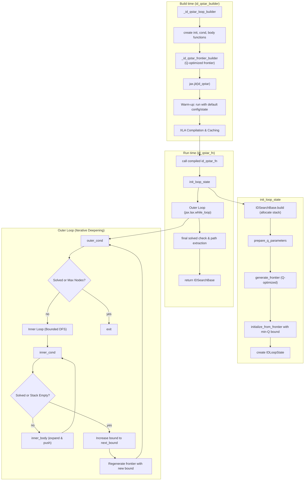
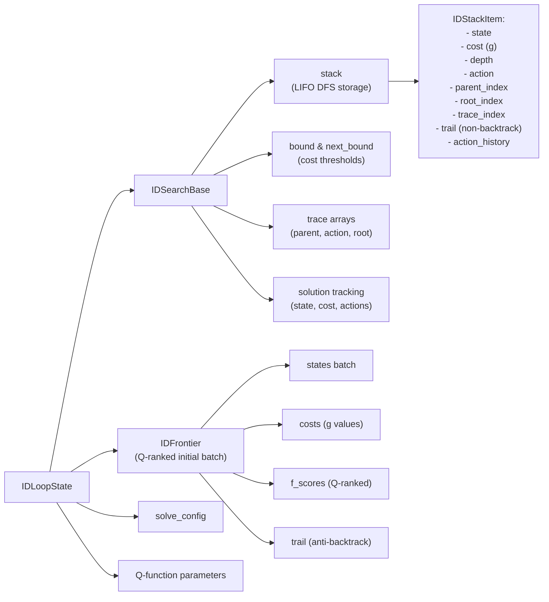
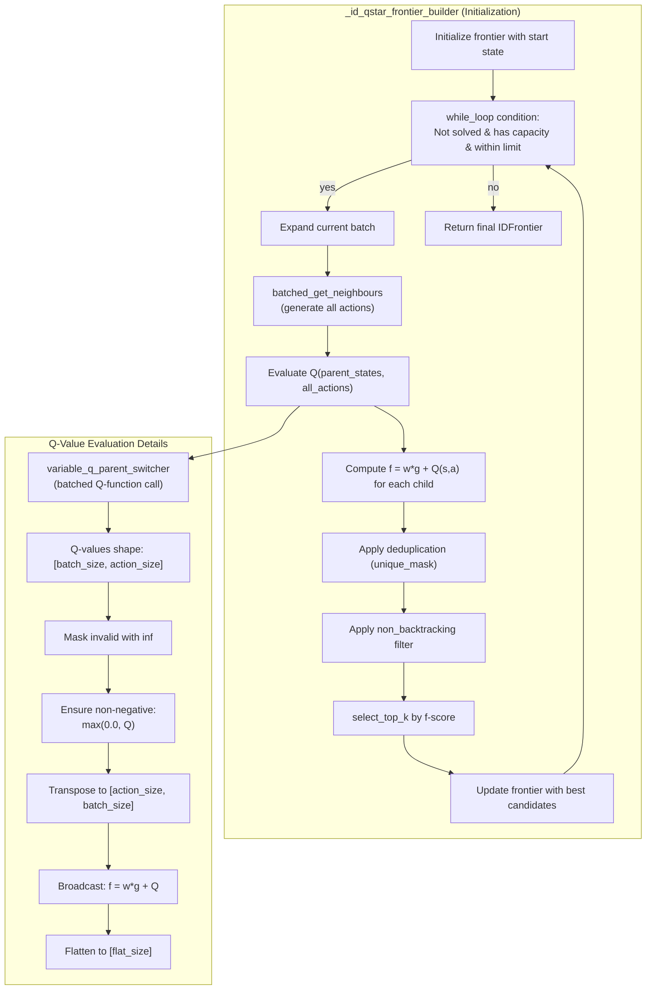
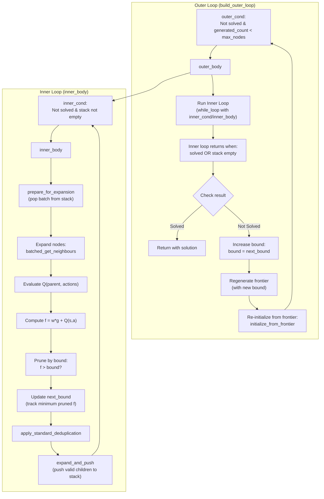
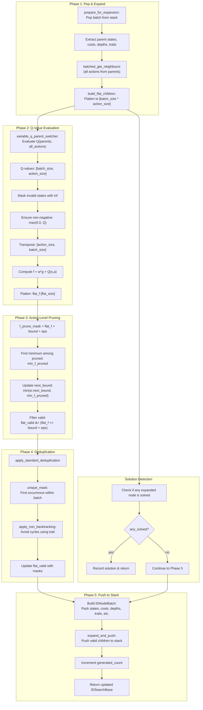
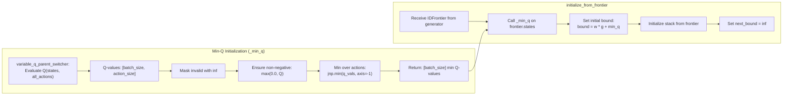
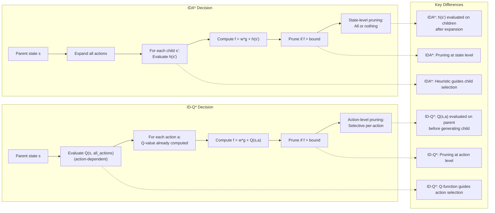
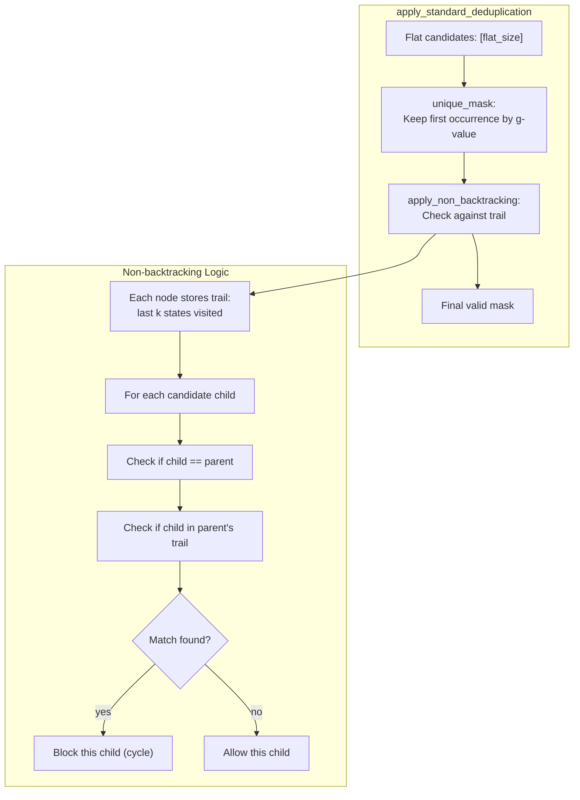

# Iterative Deepening Q\* Command (`id_qstar`)

The `id_qstar` command solves a puzzle using the Iterative Deepening Q\* (ID-Q\*) search algorithm. This is an experimental algorithm that adapts the principles of IDA\* to use learned Q-values. It performs iterative deepening search guided by Q-value estimates.

## Usage

The basic syntax for the `id_qstar` command is:

```bash
python main.py id_qstar [OPTIONS]
```

Example:

```bash
python main.py id_qstar -p rubikscube -nn
```

## Options

The `id_qstar` command uses similar option groups to the `qstar` command.

### Puzzle Options (`@puzzle_options`)

-   `-p, --puzzle`: Specifies the puzzle to solve.
-   `-pargs, --puzzle_args`: JSON string for additional puzzle arguments.
-   `-h, --hard`: Use a hard version of the puzzle.
-   `-s, --seeds`: Comma-separated list of seeds.

### Search Options (`@search_options`)

-   `-m, --max_node_size`: Max nodes to explore.
-   `-b, --batch_size`: Batch size.
-   `-w, --cost_weight`: Path cost weight.
-   `-pr, --pop_ratio`: Pop ratio.
-   `-vm, --vmap_size`: Parallel solve size via vmap.
-   `--debug`: Disable JIT.
-   `--profile`: Enable profiling.
-   `--show_compile_time`: Print compile time.

### Q-Function Options (`@qfunction_options`)

-   `-nn, --neural_qfunction`: Use neural network Q-function.
-   `--param-path`: Path to Q-function parameters.
-   `--model-type`: Q-function model type.

### Visualization Options (`@visualize_options`)

-   `-vt, --visualize_terminal`: Render path in terminal.
-   `-vi, --visualize_imgs`: Generate images/GIF.
-   `-mt, --max_animation_time`: Max GIF duration.

---

## Implementation Notes (JAxtar/id_stars/id_qstar.py)

This section documents the actual control flow and data flow in `JAxtar/id_stars/id_qstar.py`.
ID-Q* is an experimental algorithm that brings Q-function guidance to the Iterative Deepening framework. It ranks transitions using action-values, allowing the search to prioritize paths that a reinforcement learning model deems most promising.

Unlike A* which uses a priority queue, ID-Q* uses a **stack-based DFS** within bounded cost thresholds, where Q-values replace heuristics for guidance.

The implementation is built around:
- `IDSearchBase`: Stack-based search state (LIFO for DFS)
- `IDFrontier`: Initial frontier built by Q-optimized ranking
- Dual-loop structure: outer loop increases bounds, inner loop performs bounded DFS

### High-Level Control Flow



### Data Structures At A Glance



### Q-Optimized Frontier Builder Detail

Unlike standard IDA* which ranks nodes by $h(s')$, ID-Q* evaluates $Q(s, a)$ on **parent states** to build and rank its initial frontier. This makes the very first batch of nodes extremely well-filtered according to the learned policy.



**Key Insight**: The frontier builder runs a mini-search using Q-values to pre-filter the search space before the main iterative deepening loop begins.

### Detailed Dual-Loop Structure

ID-Q* uses a nested loop structure: the outer loop increases the cost bound when the inner DFS exhausts all nodes within the current bound.



### Detailed Loop Body (Inner Body) Data Flow

The inner body is where the core Q-guided bounded DFS happens. Each iteration:
1. Pops a batch from the stack
2. Generates successors
3. Evaluates Q-values for action ranking
4. Prunes based on f-value vs bound
5. Deduplicates
6. Pushes valid successors back to stack



### Min-Q Bound Initialization

For the root of each iteration, ID-Q* calculates:
$$V(s) = \min_a Q(s, a)$$
and uses this value to initialize the iterative deepening bound, ensuring that the search space expands logically according to the best estimated path.



**Why Min-Q?** Using $\min_a Q(s,a)$ gives the most optimistic (lowest cost) estimate for reaching the goal from state $s$, making it an admissible lower bound for iterative deepening.

### Comparison: IDA* vs ID-Q* Decision Making



### Action-Dependent Pruning Details

In ID-Q*, pruning is fine-grained. Instead of pruning an entire state, the search can prune specific **actions** from a parent state if their $Q(s, a)$ exceeds the current bound. This results in a highly sparse and efficient search tree.

```mermaid
flowchart TD
  subgraph ActionPrune["Action-Level Pruning Process"]
    P1["Parent batch: [batch_size] states"] --> P2["Q(s, all_actions): [batch_size, action_size]"]
    P2 --> P3["Flatten to [flat_size] where<br/>flat_size = batch_size * action_size"]
    P3 --> P4["For each (parent, action) pair:<br/>f = w*g + Q(s,a)"]
    P4 --> P5{"f > bound?"}
    P5 -- yes --> P6["Mark action invalid:<br/>flat_valid[i] = False"]
    P5 -- no --> P7["Keep action valid:<br/>flat_valid[i] = True"]
    P6 --> P8["Track min pruned f:<br/>Update next_bound"]
    P7 --> P9["Generate child state:<br/>Push to stack"]
  end

  subgraph Example["Example: 3 actions, bound=10"]
    E1["State s, g=5"] --> E2["Q(s,a1)=2, Q(s,a2)=8, Q(s,a3)=3"]
    E2 --> E3["f1=5*w+2, f2=5*w+8, f3=5*w+3"]
    E3 --> E4["If w=1: f1=7, f2=13, f3=8"]
    E4 --> E5["Action a1: f1=7 <= 10 ✓<br/>Action a2: f2=13 > 10 ✗ (pruned)<br/>Action a3: f3=8 <= 10 ✓"]
    E5 --> E6["Only a1 and a3 children pushed to stack"]
    E6 --> E7["next_bound tracks min(13) for next iteration"]
  end
```



### Deduplication and Non-backtracking

Like ID-A*, ID-Q* employs `apply_standard_deduplication` and `non_backtracking_steps` to handle cycles and local oscillations, which is critical for search efficiency in complex puzzle environments.



**Trail Management**: Each node maintains a trail of the last `non_backtracking_steps` states. When expanding, children that match any state in the trail are filtered out, preventing local cycles and redundant exploration.

### JIT Compilation Strategy

`id_qstar_builder(...)` returns a JIT-compiled function (`id_qstar_fn = jax.jit(id_qstar)`).
To avoid extremely long compilation times from tracing complex puzzle logic on real inputs,
it triggers compilation once using `puzzle.SolveConfig.default()` and `puzzle.State.default()`.

This means:

- First call compiles and caches the XLA program.
- Subsequent calls reuse the compiled program as long as shapes/dtypes/static args match.
