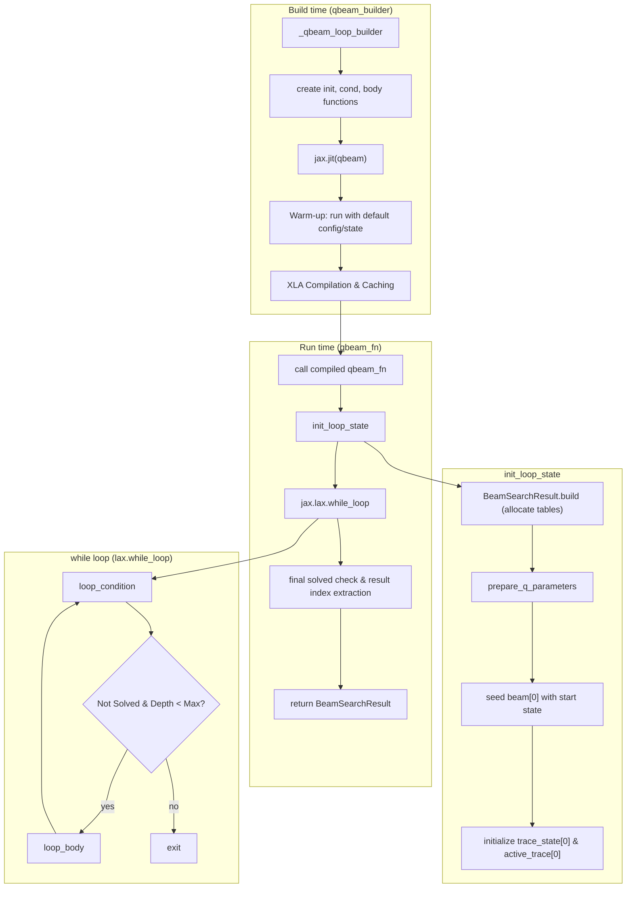
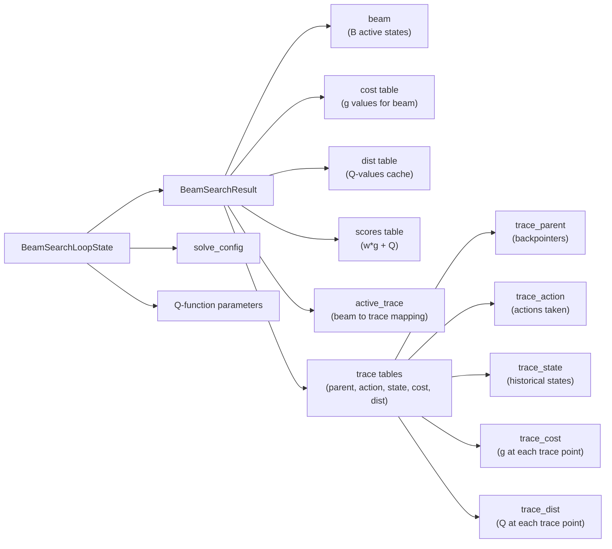
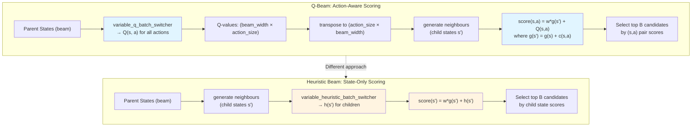
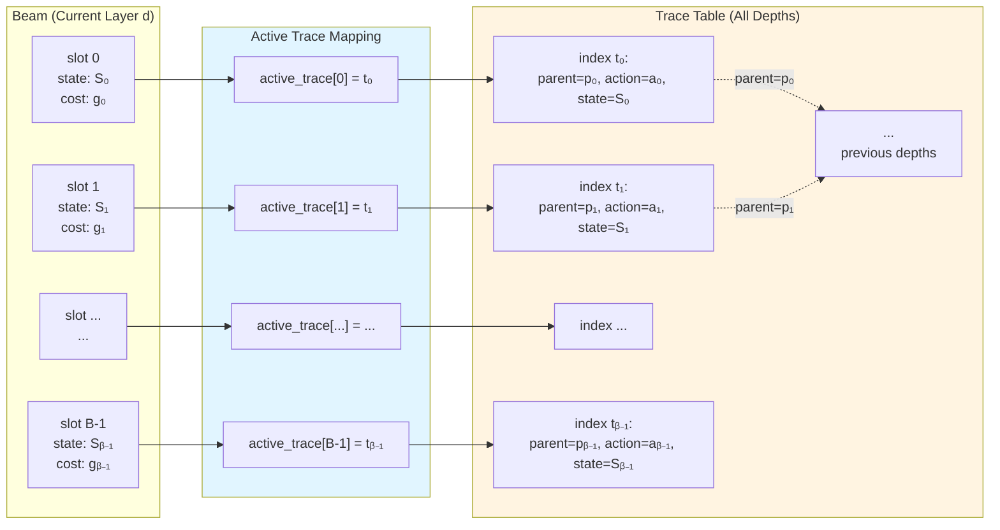

# Q-Beam Search Command (`qbeam`)

The `qbeam` command solves a puzzle using a variation of Beam Search guided by a Q-function (Q-Beam). Instead of a standard heuristic $h(n)$, it uses the learned Q-values $Q(s, a)$ to score and select nodes. This allows for beam search strategies driven by reinforcement learning models.

## Usage

The basic syntax for the `qbeam` command is:

```bash
python main.py qbeam [OPTIONS]
```

Example:

```bash
python main.py qbeam -p rubikscube -nn -b 5000
```

## Options

The `qbeam` command combines beam search mechanics with Q-function options.

### Puzzle Options (`@puzzle_options`)

-   `-p, --puzzle`: Specifies the puzzle to solve.
    -   Type: `Choice`
    -   Default: `n-puzzle`
-   `-pargs, --puzzle_args`: JSON string for additional puzzle-specific arguments.
    -   Type: `String`
-   `-h, --hard`: If available, use a "hard" version of the puzzle.
    -   Type: `Flag`
-   `-s, --seeds`: A comma-separated list of seeds for generating initial puzzle states.
    -   Type: `String`
    -   Default: `"0"`

### Search Options (`@search_options`)

For Q-Beam Search:

-   `-b, --batch_size`: **Critical.** Sets the **Beam Width** (or capacity) for the search.
    -   Type: `Integer`
    -   Default: `10000`
-   `-m, --max_node_size`: The maximum number of nodes to explore.
    -   Type: `String`
-   `-w, --cost_weight`: The weight `w` for the path cost in the priority calculation.
    -   Type: `Float`
-   `-pr, --pop_ratio`: Ratio for popping nodes.
    -   Type: `Float`
-   `-vm, --vmap_size`: The number of different initial states to solve in parallel.
    -   Type: `Integer`
-   `--debug`: Disables JIT compilation.
    -   Type: `Flag`
-   `--profile`: Enables profiler.
    -   Type: `Flag`
-   `--show_compile_time`: Prints compilation time.
    -   Type: `Flag`

### Q-Function Options (`@qfunction_options`)

-   `-nn, --neural_qfunction`: Use a pre-trained neural network as the Q-function.
    -   Type: `Flag`
-   `--param-path`: Path to the Q-function parameter file.
    -   Type: `String`
-   `--model-type`: Type of the Q-function model.
    -   Type: `String`

### Visualization Options (`@visualize_options`)

-   `-vt, --visualize_terminal`: Renders the solution path in the terminal.
    -   Type: `Flag`
-   `-vi, --visualize_imgs`: Generates images and GIF for the solution.
    -   Type: `Flag`
-   `-mt, --max_animation_time`: Max duration for GIF.
    -   Type: `Integer`

---

## Implementation Notes (JAxtar/beamsearch/q_beam.py)

This section documents the actual control flow and data flow in `JAxtar/beamsearch/q_beam.py`.
Q-Beam Search is a memory-efficient variant that combines beam search pruning with Q-function guidance.
Unlike A*/Q* which use hash tables and priority queues, Q-Beam maintains only a fixed-width beam
of states at each depth level, using a trace system for path reconstruction.

The core data structure is `BeamSearchResult`:
- `beam`: Current set of active states (width B)
- `active_trace`: Maps each beam slot to a trace table index
- `trace_parent / trace_action / trace_state`: Historical records across all depths

The core loop is built by `_qbeam_loop_builder(...)` and executed by `jax.lax.while_loop`.

### High-Level Control Flow



### Data Structures At A Glance



### Loop Body Data Flow (One Iteration)

The Q-Beam loop body expands all beam states in parallel, scores successor states using
Q-values from the parent states, selects the top-scoring candidates, deduplicates them,
applies non-backtracking filtering, and updates the beam and trace tables.

Key implementation details from `JAxtar/beamsearch/q_beam.py`:

- **Q-Value Evaluation on Parents**: Unlike heuristic beam which evaluates h(s') on children,
  Q-Beam evaluates Q(s,a) on parent states before expansion. This produces action-aware scores
  for state-action pairs rather than just child states.
- **Scoring Formula**: `score(s,a) = w * g(s') + Q(s,a)` where `Q(s,a) = h(s') + c(s,a)` is
  recovered by subtracting the transition cost from the computed Q-value.
- **Trace System**: Without a global hash table, Q-Beam uses a fixed-size trace table indexed
  by `(depth * beam_width + slot)` to record the search tree for path reconstruction.
- **Non-backtracking**: Optional filtering prevents cycles by checking that candidates don't
  match their N most recent ancestors in the trace table.

```mermaid
flowchart TD
  subgraph Phase1["Phase 1: Expand & Score"]
    S1["fetch beam states & filled_mask"] --> S2["batched_get_neighbours<br/>(action_size × beam_width)"]
    S2 --> S3["compute child_costs = g(parent) + c(s,a)"]
    S3 --> S4["variable_q_batch_switcher<br/>Q-values for parent states"]
    S4 --> S5["transpose & recover Q(s,a)<br/>q_vals = Q - transition_cost"]
    S5 --> S6["scores = w * child_costs + q_vals"]
  end

  subgraph Phase2["Phase 2: Select Beam"]
    S6 --> S7["flatten candidates<br/>(action_size × beam_width → flat_count)"]
    S7 --> S8["select_beam (top-k by score)"]
    S8 --> S9["selected_idx, keep_mask"]
    S9 --> S10["gather selected states, costs, Q-values<br/>decode action & parent indices"]
  end

  subgraph Phase3["Phase 3: Deduplicate & Filter"]
    S10 --> S11["xnp.unique_mask<br/>(in-batch deduplication by state)"]
    S11 --> S12["non_backtracking_mask<br/>(check against trace history)"]
    S12 --> S13["selected_valid = keep ∧ unique ∧ allowed"]
    S13 --> S14["mask out invalid entries<br/>(costs, Q-values, scores → inf)"]
  end

  subgraph Phase4["Phase 4: Update Trace Table"]
    S14 --> S15["compute next_trace_ids<br/>= (depth+1) * beam_width + slot_indices"]
    S15 --> S16["trace_parent[next_trace_ids] = parent_trace_ids"]
    S16 --> S17["trace_action[next_trace_ids] = selected_actions"]
    S17 --> S18["trace_cost/dist/depth/state[next_trace_ids] = selected_*"]
    S18 --> S19["active_trace = next_trace_ids (or INVALID)"]
  end

  subgraph Phase5["Phase 5: Update Beam & Advance"]
    S19 --> S20["beam = selected_states"]
    S20 --> S21["cost/dist/scores = selected_*"]
    S21 --> S22["parent_index = selected_parents"]
    S22 --> S23["generated_size += count(selected_valid)"]
    S23 --> S24["depth += 1"]
    S24 --> S25["return new BeamSearchLoopState"]
  end
```



### Q-Value Integration (Key Difference from Heuristic Beam)

Q-Beam evaluates Q-values on the parent states before expansion, creating action-aware scores.
This is fundamentally different from heuristic beam search which evaluates h(s') on child states.



### Detailed Loop Body Data Flow

This diagram shows the complete flow through one iteration of the Q-Beam loop body,
highlighting the Q-value evaluation and action-aware selection process.

```mermaid
flowchart TD
  Start["loop_body(loop_state)"] --> Extract["Extract from search_result:<br/>beam, cost, active_trace, filled_mask"]

  Extract --> Expand["puzzle.batched_get_neighbours<br/>(beam_states, filled_mask)"]
  Expand --> Neighbours["neighbours: (action_size × beam_width)<br/>transition_cost: (action_size × beam_width)"]

  Neighbours --> ComputeCosts["child_costs = base_costs[newaxis,:] + transition_cost<br/>child_valid = filled_mask[newaxis,:] ∧ isfinite(child_costs)"]

  ComputeCosts --> QEval{"any(child_valid)?"}
  QEval -- yes --> QCalc["variable_q_batch_switcher<br/>(q_parameters, beam_states, filled_mask)"]
  QEval -- no --> QFill["q_vals = full(inf)"]

  QCalc --> QTranspose["transpose & recover Q(s,a)<br/>q_vals = Q.T - transition_cost"]
  QTranspose --> Score
  QFill --> Score["scores = w * child_costs + q_vals"]

  Score --> Flatten["flatten to (flat_count,):<br/>flat_states, flat_cost, flat_q, flat_scores, flat_valid"]

  Flatten --> SelectBeam["select_beam(flat_scores, beam_width)"]
  SelectBeam --> Selected["selected_scores, selected_idx, keep_mask"]

  Selected --> Gather["gather selected_* arrays<br/>decode action & parent indices:<br/>action = idx // beam_width<br/>parent = idx % beam_width"]

  Gather --> UniqueMask["xnp.unique_mask(selected_states,<br/>key=selected_scores, filled=selected_valid)"]
  UniqueMask --> UniqueValid["selected_valid ∧= unique_valid"]

  UniqueValid --> NonBacktrack{"non_backtracking_steps > 0?"}
  NonBacktrack -- yes --> NBMask["non_backtracking_mask<br/>(check vs trace history)"]
  NonBacktrack -- no --> MaskVals
  NBMask --> AllowedMask["selected_valid ∧= allowed_mask"]
  AllowedMask --> MaskVals["mask invalid entries:<br/>costs, Q-values, scores → inf<br/>parent_trace_ids → INVALID"]

  MaskVals --> TraceCalc["compute next_trace_ids:<br/>offset = (depth+1) * beam_width<br/>next_trace_ids = offset + [0..B-1]"]

  TraceCalc --> TraceUpdate["Update trace tables at next_trace_ids:<br/>trace_parent, trace_action, trace_cost,<br/>trace_dist, trace_depth, trace_state"]

  TraceUpdate --> BeamUpdate["Update beam arrays:<br/>beam = selected_states<br/>cost, dist, scores = selected_*<br/>parent_index = selected_parents<br/>active_trace = next_trace_ids"]

  BeamUpdate --> Counter["generated_size += sum(selected_valid)<br/>depth += 1"]

  Counter --> Return["return BeamSearchLoopState"]

  style QCalc fill:#e1f5ff
  style QTranspose fill:#e1f5ff
  style Score fill:#e1f5ff
  style TraceUpdate fill:#fff4e1
  style BeamUpdate fill:#ffe1e1
```



### Trace Table System

Q-Beam (and heuristic beam) use a trace table system instead of a global hash table.
This trades completeness for memory efficiency.



### Comparison: Beam (Heuristic) vs Q-Beam (Q-Value)

| Aspect | Heuristic Beam | Q-Beam |
|--------|----------------|--------|
| **Guidance Function** | Heuristic h(s') on child states | Q-function Q(s,a) on parent states |
| **Scoring Formula** | f(s') = w·g(s') + h(s') | f(s,a) = w·g(s') + Q(s,a) |
| **Evaluation Point** | After expansion (on children) | Before expansion (on parents) |
| **Action Awareness** | No - scores child states | Yes - scores (state, action) pairs |
| **Use Case** | Domain-specific heuristics | Trained Q-functions (RL) |
| **Memory** | Beam width B × max depth D | Beam width B × max depth D |
| **Completeness** | No (beam pruning) | No (beam pruning) |
| **Optimality** | No (greedy selection) | No (greedy selection) |

### Key Implementation Differences

The main algorithmic difference between heuristic beam and Q-Beam is when and how the guidance function is evaluated:

**Heuristic Beam** (`heuristic_beam.py`):
```python
# Expand first
neighbours, transition_cost = puzzle.batched_get_neighbours(...)

# Flatten children
flat_states = neighbours.reshape((flat_count,))

# Evaluate h(s') on children after deduplication
chunk_dists = variable_heuristic_batch_switcher(
    heuristic_parameters,
    chunk_states,  # child states
    row_mask,
)

# Score children
scores = cost_weight * child_costs + dists
```

**Q-Beam** (`q_beam.py`):
```python
# Expand first
neighbours, transition_cost = puzzle.batched_get_neighbours(...)

# Evaluate Q(s,a) on parents BEFORE processing children
vals = variable_q_batch_switcher(q_parameters, beam_states, filled_mask)  # parent states
vals = vals.transpose()  # (beam_width, action_size) → (action_size, beam_width)

# Recover Q(s,a) by subtracting transition cost
q_vals = vals - transition_cost  # Q(s,a) = h(s') + c(s,a)

# Score (s,a) pairs
scores = cost_weight * child_costs + q_vals
```

This makes Q-Beam inherently action-aware, allowing it to prefer specific actions from each
parent state based on learned Q-values, rather than just ranking child states by heuristic value.
