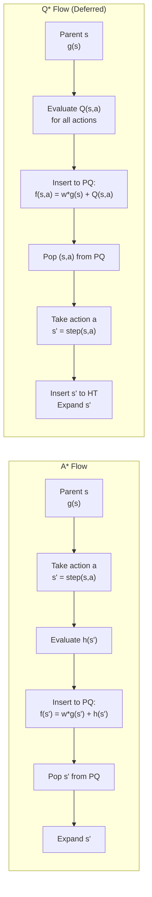
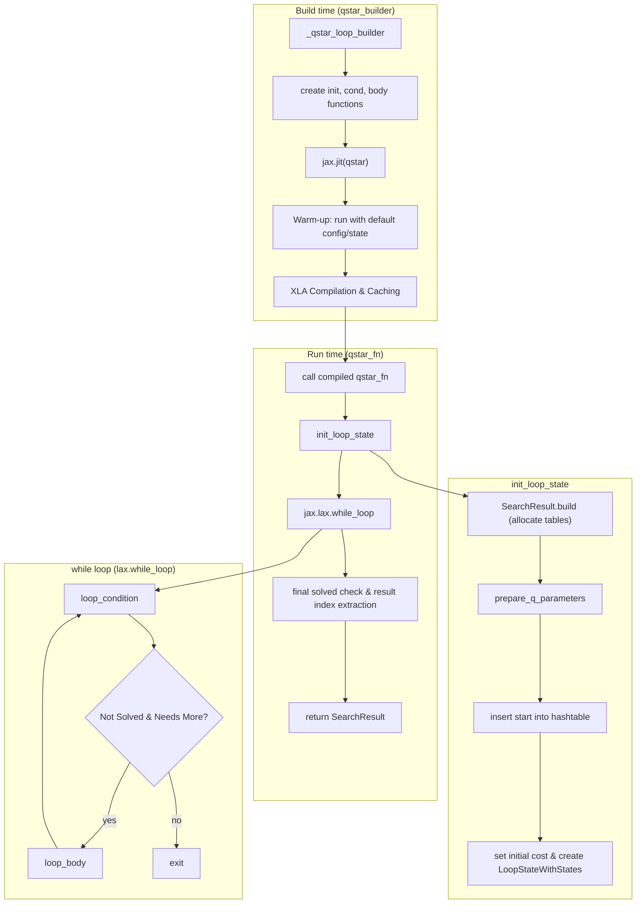
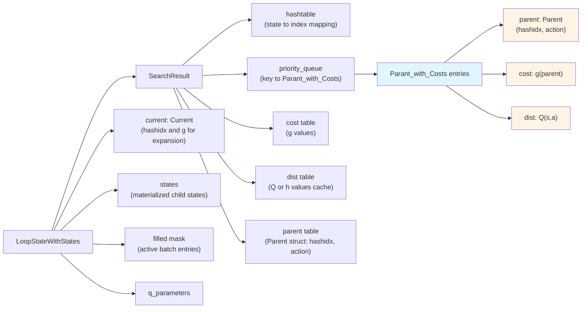
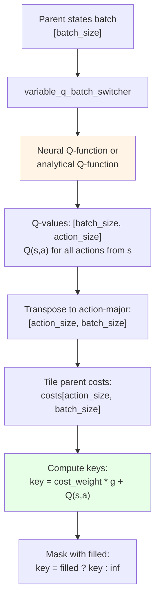
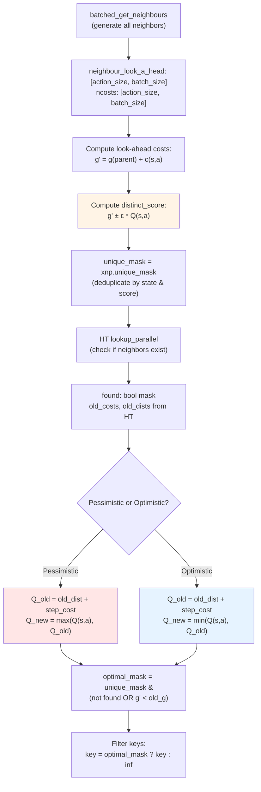
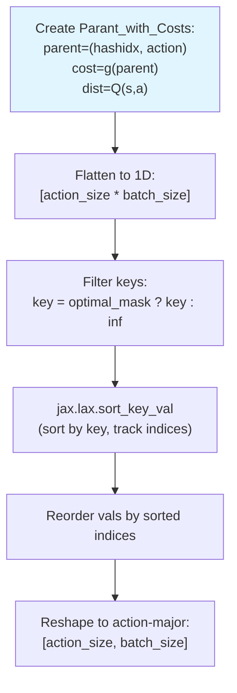
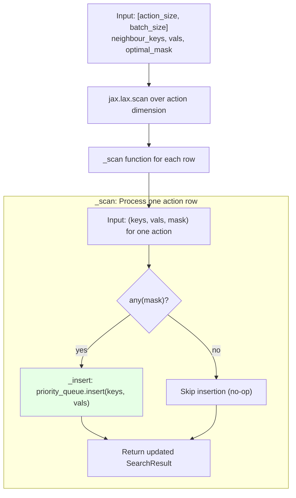
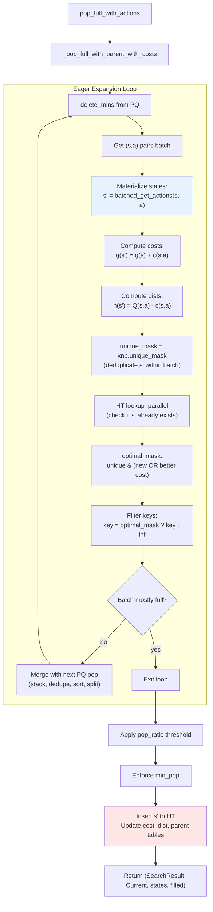
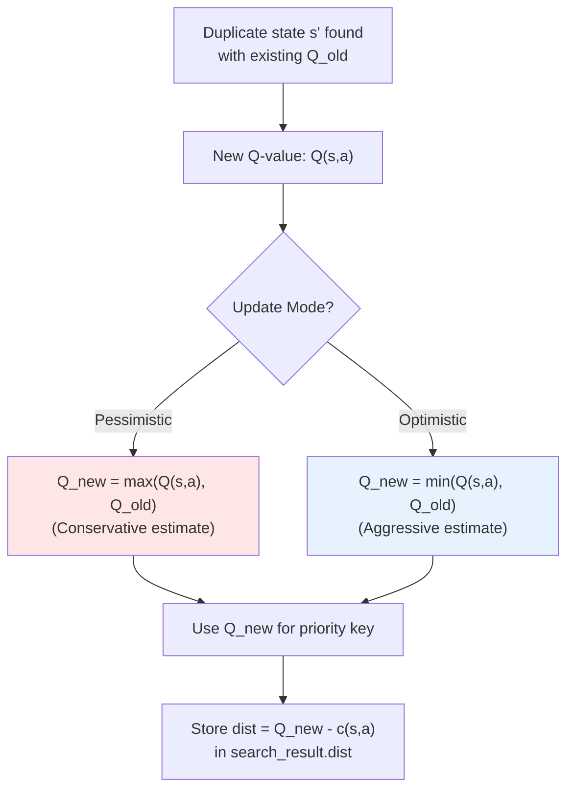

# Q\* Command

The `qstar` command solves a puzzle using the Q\* search algorithm. Q\* is a variation of A\* that is particularly useful in reinforcement learning contexts, where a Q-function is learned to estimate the cost-to-go. This implementation is fully JIT-compiled with JAX for high performance on accelerators.

## Usage

The basic syntax for the `qstar` command is:

```bash
python main.py qstar [OPTIONS]
```

A common use case is to solve a specific puzzle with a neural Q-function:

```bash
python main.py qstar -p rubikscube -nn
```

## Options

The `qstar` command uses a combination of option groups to configure the puzzle, search algorithm, Q-function, and visualization.

### Puzzle Options (`@puzzle_options`)

These options define the puzzle environment to be solved.

-   `-p, --puzzle`: Specifies the puzzle to solve.
    -   Type: `Choice`
    -   Default: `n-puzzle`
    -   Choices: `n-puzzle`, `rubikscube`, `slidepuzzle`, etc. (depends on configuration).
-   `-pargs, --puzzle_args`: JSON string for additional puzzle-specific arguments.
    -   Type: `String`
    -   Example: `python main.py qstar -pargs '{"size": 4}'`
-   `-h, --hard`: If available, use a "hard" version of the puzzle.
    -   Type: `Flag`
-   `-s, --seeds`: A comma-separated list of seeds for generating initial puzzle states. Using multiple seeds will run the solver multiple times.
    -   Type: `String`
    -   Default: `"0"`

### Search Options (`@search_options`)

These options control the behavior of the Q\* search algorithm itself.

-   `-m, --max_node_size`: The maximum number of nodes to explore. Supports scientific notation.
    -   Type: `String`
-   `-b, --batch_size`: The number of nodes to process in a single batch on the GPU.
    -   Type: `Integer`
-   `-w, --cost_weight`: The weight `w` for the path cost in the search priority calculation, which is analogous to `f(n) = w * g(n) + Q(s,a)`. A lower value prioritizes states with better Q-values, making the search greedier.
    -   Type: `Float`
-   `-pr, --pop_ratio`: Ratio for popping nodes from the priority queue.
    -   Type: `Float`
-   `-vm, --vmap_size`: The number of different initial states to solve in parallel using `jax.vmap`.
    -   Type: `Integer`
-   `--debug`: Disables JIT compilation for easier debugging.
    -   Type: `Flag`
-   `--profile`: Enables `jax.profiler` and saves a trace to `tmp/tensorboard`.
    -   Type: `Flag`
-   `--show_compile_time`: Prints the JIT compilation time.
    -   Type: `Flag`

### Q-Function Options (`@qfunction_options`)

These options determine which Q-function to use for guiding the search.

-   `-nn, --neural_qfunction`: Use a pre-trained neural network as the Q-function. If not set, a default, non-ML Q-function is used.
    -   Type: `Flag`
-   `--param-path`: Path to the Q-function parameter file.
    -   Type: `String`
-   `--model-type`: Type of the Q-function model.
    -   Type: `String`

### Visualization Options (`@visualize_options`)

These options control how the final solution path is displayed.

-   `-vt, --visualize_terminal`: Renders the solution path step-by-step in the terminal.
    -   Type: `Flag`
-   `-vi, --visualize_imgs`: Generates an image for each step of the solution and saves them, along with a GIF animation, in a timestamped folder within `tmp/`.
    -   Type: `Flag`
-   `-mt, --max_animation_time`: Sets the maximum duration for the generated GIF animation, in seconds. The frame rate is adjusted to fit this duration.
    -   Type: `Integer`
    -   Default: `10`

---

## Implementation Notes (JAxtar/stars/qstar.py)

This section documents the actual control flow and data flow in `JAxtar/stars/qstar.py`.
The implementation is a batched, JIT-compiled Q* variant built around two JAX-native data
structures inside `SearchResult`:

- `hashtable`: state deduplication + index assignment (stable IDs for states)
- `priority_queue`: frontier ordering by `key = cost_weight * g + Q(s, a)`

The core loop is built by `_qstar_loop_builder(...)` and executed by `jax.lax.while_loop`.

### Q* vs A*: Key Algorithmic Differences

Q* is a search algorithm that leverages a Q-function $Q(s, a)$ to estimate the cumulative cost-to-go from state $s$ by taking action $a$. Unlike standard A* which evaluates heuristics $h(s')$ on child states, Q* ranks frontier expansion candidates $(s, a)$ based on the parent's Q-values.

| Feature | A* (Standard) | Q* (Deferred) |
| :--- | :--- | :--- |
| **PQ Key** | $f(s') = w \cdot g(s) + c(s, a) + h(s')$ | $f(s, a) = w \cdot g(s) + Q(s, a)$ |
| **Evaluation Point** | On child states $s'$ after expansion | On parent states $s$ before expansion |
| **PQ Entry Type** | State $s'$ (Current) | (Parent $s$, Action $a$) (Parant_with_Costs) |
| **When Evaluated** | After taking action (child state) | Before taking action (parent state-action pair) |
| **State Materialization** | Before PQ insertion | After PQ pop (deferred) |
| **Pruning** | After child generation | Look-ahead or after pop |



### High-Level Control Flow



### Data Structures At A Glance



**Key Data Structure: `Parant_with_Costs`**

Unlike A* which stores `Current` (child state index + cost) in the PQ, Q* stores `Parant_with_Costs`:
- `parent.hashidx`: Index of parent state in the hash table
- `parent.action`: Action index to take from parent
- `cost`: The $g$-value of the **parent** (not child)
- `dist`: The $Q(s, a)$ value (estimated cost-to-go for taking action $a$ from state $s$)

This enables Q* to defer state materialization until after popping from the PQ, evaluating the Q-function on parent states rather than generating all children upfront.

### Loop Body Data Flow (One Iteration)

The loop body in Q* differs significantly from A* because:
1. **States are already materialized** from the previous iteration's `pop_full_with_actions`
2. **Q-values are evaluated on parent states** before expansion
3. **Look-ahead pruning** can peek at neighbors to filter out dominated candidates

Key implementation details from `JAxtar/stars/qstar.py`:

- Q-function evaluation is batched: `variable_q_batch_switcher(q_parameters, states, filled)`
- Returns Q-values for all actions: `[batch_size, action_size]`
- Priority keys are computed as: `key = cost_weight * g(parent) + Q(s, a)`
- Look-ahead pruning (optional) expands neighbors to check hashtable for duplicates/better paths
- Pessimistic/optimistic update modes handle Q-value aggregation when duplicates are found

```mermaid
flowchart TD
  subgraph Phase1["Phase 1: Q-Evaluation on Parent States"]
    S1["Input: states (from previous pop)"] --> S2["variable_q_batch_switcher<br/>(Q-function evaluation)"]
    S2 --> S3["q_vals: [action_size, batch_size]<br/>Q(s,a) for all actions"]
    S3 --> S4["Compute keys:<br/>key = w*g(parent) + Q(s,a)"]
  end

  subgraph Phase2["Phase 2: Look-ahead Pruning (Optional)"]
    S5["batched_get_neighbours<br/>(peek at neighbor states)"] --> S6["HT lookup_parallel<br/>(check if neighbors exist)"]
    S6 --> S7["Cost comparison:<br/>new_g < old_g?"]
    S7 --> S8["Pessimistic/Optimistic Update:<br/>Q_new = max/min(Q_new, Q_old)"]
    S8 --> S9["unique_mask & optimal_mask<br/>(filter duplicates & dominated)"]
  end

  subgraph Phase3["Phase 3: Candidate Sorting & Filtering"]
    S10["Create Parant_with_Costs entries"] --> S11["Sort by key<br/>(keep best candidates first)"]
    S11 --> S12["Reshape into action-major rows<br/>[action_size, batch_size]"]
  end

  subgraph Phase4["Phase 4: PQ Insertion (Scan)"]
    S12 --> S13["jax.lax.scan over action rows"]
    S13 --> S14["_scan: Insert row to PQ if any(mask)"]
  end

  subgraph Phase5["Phase 5: Pop Next Batch (Deferred Expansion)"]
    S14 --> S15["pop_full_with_actions"]
    S15 --> S16["_pop_full_with_parent_with_costs:<br/>eager expansion loop"]
    S16 --> S17["Materialize states: s' = step(s,a)"]
    S17 --> S18["Deduplicate expanded states"]
    S18 --> S19["Insert s' to HT & update cost/parent"]
    S19 --> S20["Return new LoopStateWithStates<br/>with materialized states"]
  end

  S4 --> S5
  S9 --> S10
  S20 -.-> S1

  style S2 fill:#ffe6e6
  style S15 fill:#e6ffe6
  style S17 fill:#e6f3ff
```



### Detailed Phase Breakdown

#### Phase 1: Q-Evaluation on Parent States

Unlike A* which evaluates heuristics on child states **after** expansion, Q* evaluates Q-values on parent states **before** expansion.



**Code mapping:**
```python
# Line 128-132 in qstar.py
q_vals = variable_q_batch_switcher(q_parameters, states, filled)
q_vals = q_vals.transpose().astype(KEY_DTYPE)  # [action_size, batch_size]
neighbour_keys = (cost_weight * costs + q_vals).astype(KEY_DTYPE)
neighbour_keys = jnp.where(filled_tiles, neighbour_keys, jnp.inf)
```

#### Phase 2: Look-ahead Pruning (Optional)

When `look_ahead_pruning=True`, Q* performs an inexpensive expansion filter by peeking at neighbor states before inserting (s,a) pairs into the PQ.



**Why distinct_score?**

The `distinct_score` uses a small epsilon ($\pm 1\times10^{-5}$) to break ties when multiple (s,a) pairs lead to the same state:
- **Pessimistic** (`dist_sign = -1.0`): `score = g' - ε * Q(s,a)` → prefers **higher** Q-values (more conservative)
- **Optimistic** (`dist_sign = 1.0`): `score = g' + ε * Q(s,a)` → prefers **lower** Q-values (more aggressive)

**Code mapping:**
```python
# Line 152-196 in qstar.py
neighbour_look_a_head, ncosts = puzzle.batched_get_neighbours(solve_config, states, filled)
look_a_head_costs = costs + ncosts
distinct_score = flattened_look_a_head_costs + dist_sign * 1e-5 * dists
unique_mask = xnp.unique_mask(flattened_neighbour_look_head, distinct_score, flattened_filled_tiles)
current_hash_idxs, found = search_result.hashtable.lookup_parallel(...)
better_cost_mask = jnp.less(flattened_look_a_head_costs, old_costs)
optimal_mask = unique_mask & (jnp.logical_or(~found, better_cost_mask))
```

#### Phase 3: Candidate Sorting & Filtering



**Code mapping:**
```python
# Line 200-217 in qstar.py
flattened_vals = Parant_with_Costs(
    parent=Parent(hashidx=idx_tiles.flatten(), action=action.flatten()),
    cost=costs.flatten(),
    dist=dists,
)
flattened_neighbour_keys = jnp.where(optimal_mask, flattened_keys, jnp.inf)
sorted_key, sorted_idx = jax.lax.sort_key_val(flattened_neighbour_keys, jnp.arange(flat_size))
sorted_vals = flattened_vals[sorted_idx]
```

#### Phase 4: PQ Insertion (Scan)



**Why scan instead of bulk insert?**

Using `jax.lax.scan` enables conditional insertion per action row, avoiding unnecessary PQ operations when a row has no valid candidates (all `mask=False`).

**Code mapping:**
```python
# Line 227-244 in qstar.py
def _scan(search_result: SearchResult, val):
    neighbour_keys, vals, mask = val
    search_result = jax.lax.cond(
        jnp.any(mask),
        _insert,
        lambda search_result, *args: search_result,
        search_result,
        neighbour_keys,
        vals,
    )
    return search_result, None


search_result, _ = jax.lax.scan(_scan, search_result, (neighbour_keys, vals, optimal_mask))
```

#### Phase 5: Pop Next Batch (Deferred Expansion)

This is the **key difference** from A*: Q* defers state materialization until after popping from the PQ.



**Eager expansion rationale:**

In highly reversible environments (common in puzzles), many (s,a) pairs in the PQ may lead to duplicate states. The eager expansion loop ensures that the returned batch contains only **unique, optimal states**, preventing batch starvation.

**Code mapping:**
```python
# Line 425-676 in search_base.py (_pop_full_with_parent_with_costs)
def _expand_and_filter(search_result, key, val):
    parent_states = search_result.get_state(val.parent)
    parent_actions = val.parent.action
    current_states, ncosts = puzzle.batched_get_actions(solve_config, parent_states, parent_actions, filled)
    current_costs = parent_costs + ncosts
    current_dists = val.dist - ncosts  # Reconstruct h(s') from Q(s,a)
    unique_mask = xnp.unique_mask(current_states, current_costs, filled)
    current_hash_idxs, found = search_result.hashtable.lookup_parallel(current_states, unique_mask)
    optimal_mask = unique_mask & (jnp.logical_or(~found, better_cost_mask))
    return current_states, current_costs, current_dists, filtered_key
```

### Pessimistic vs Optimistic Update Modes

When look-ahead pruning finds a duplicate state, Q* must decide how to aggregate Q-values:



**When to use each mode:**

- **Pessimistic** (default): Safer for learned Q-functions with uncertainty. Maintains the **maximum** Q-value (worst-case estimate) to avoid over-optimistic pruning.
- **Optimistic**: Better for accurate Q-functions or admissible heuristics. Maintains the **minimum** Q-value (best-case estimate) for more aggressive search.

**Mathematical interpretation:**

In Q*, the `dist` field stores $Q(s,a) - c(s,a)$ after expansion, so:
- Reconstructed Q-value: $Q_{\text{old}} = \text{dist}(s') + c(s,a)$
- Pessimistic update: $\text{dist}_{\text{new}} = \max(Q(s,a), Q_{\text{old}}) - c(s,a)$
- Optimistic update: $\text{dist}_{\text{new}} = \min(Q(s,a), Q_{\text{old}}) - c(s,a)$

**Code mapping:**
```python
# Line 176-189 in qstar.py
if pessimistic_update:
    step_cost = ncosts.flatten().astype(KEY_DTYPE)
    q_old = old_dists.astype(KEY_DTYPE) + step_cost
    q_old_for_max = jnp.where(found, q_old, -jnp.inf)
    dists = jnp.maximum(dists, q_old_for_max)
else:
    step_cost = ncosts.flatten().astype(KEY_DTYPE)
    q_old = old_dists.astype(KEY_DTYPE) + step_cost
    q_old_for_min = jnp.where(found, q_old, jnp.inf)
    dists = jnp.minimum(dists, q_old_for_min)
```

### JIT Compilation Strategy

`qstar_builder(...)` returns a JIT-compiled function (`qstar_fn = jax.jit(qstar)`).
To avoid extremely long compilation times from tracing complex puzzle logic on real inputs,
it triggers compilation once using `puzzle.SolveConfig.default()` and `puzzle.State.default()`.

This means:

- First call compiles and caches the XLA program.
- Subsequent calls reuse the compiled program as long as shapes/dtypes/static args match.
